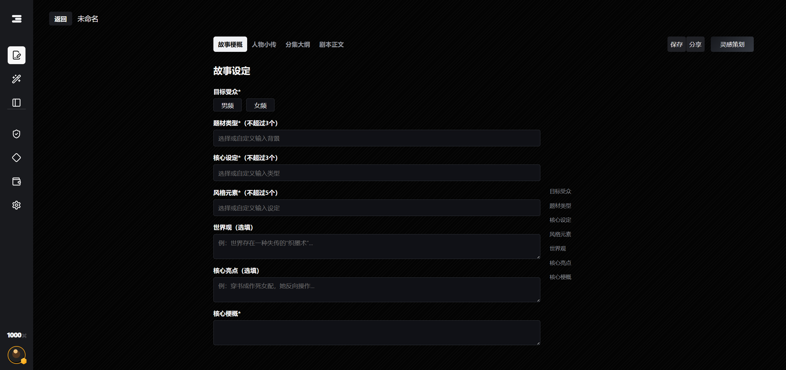
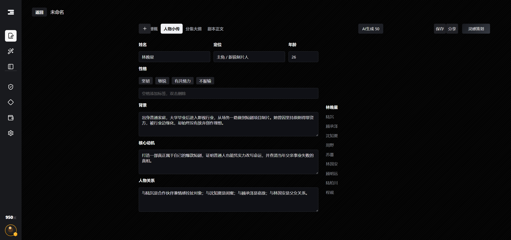
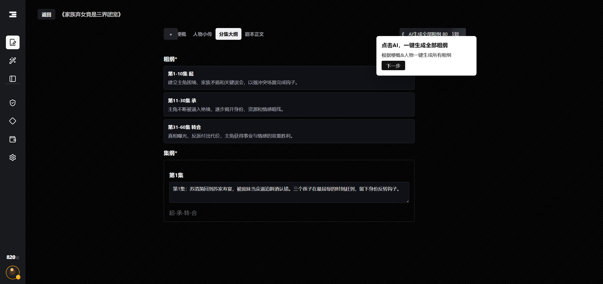
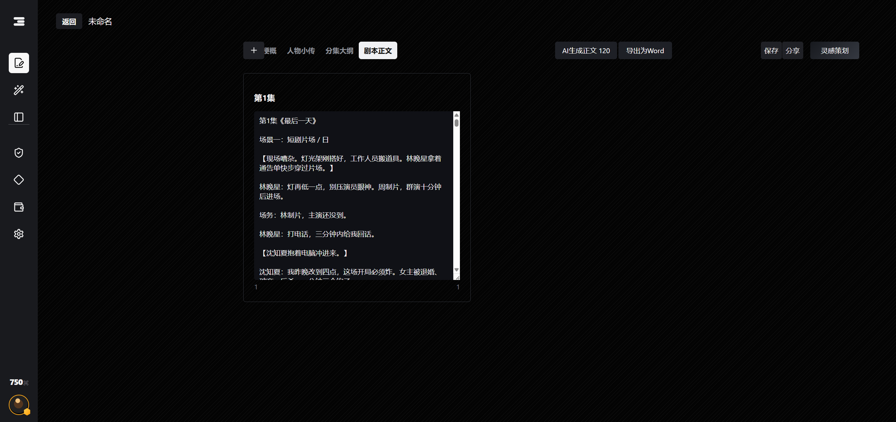
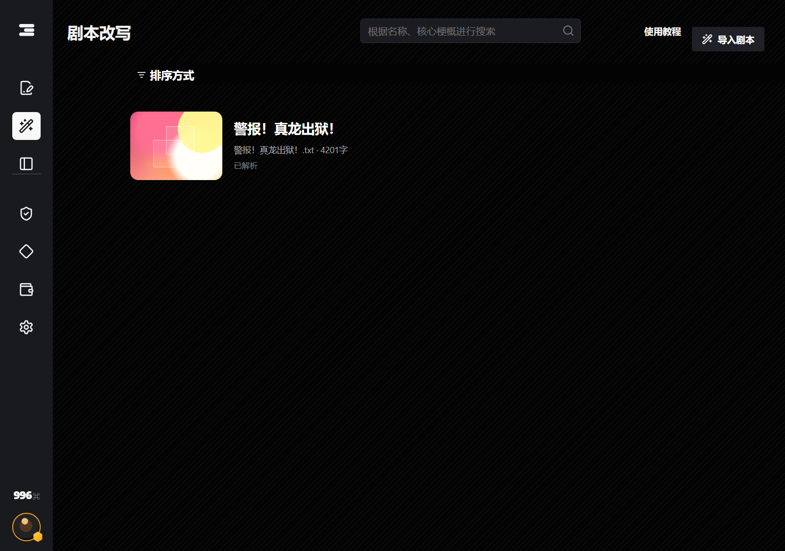
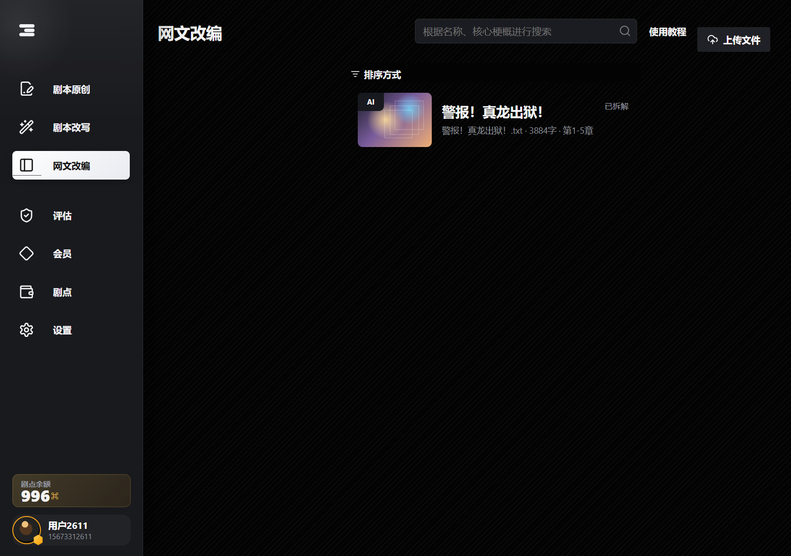

# MiaoMuse

MiaoMuse is a local AI-assisted script creation workspace for short drama writing. It combines project management, story setup, character biographies, phase outlines, episode outlines, streaming body generation, rewrite import, novel adaptation import, Word export, wallet-style usage tracking, and local API configuration in one Go + Vue application.

The project is designed as a self-hosted creative tool: your scripts, drafts, generated content, and model configuration stay on your own machine unless you connect an external model provider.


## Features

- Original script creation workflow: story settings, characters, rough outline, episode outline, and script body.
- Streaming AI generation for characters, outlines, episode outlines, and episode body text.
- Body editor with per-episode cards, batch generation ranges, expand mode, auto-scroll while streaming, and Word export.
- Script rewrite and web novel adaptation entry points with upload-driven project creation.
- Project lists for original, rewrite, and adaptation workspaces with consistent card actions.
- Local wallet-style usage UI for generation cost visibility.
- Settings page for profile display, account security, contact info, and AI provider configuration.
- OpenAI-compatible API configuration through the UI or environment variables.

## Preview

### Story Setup



### Character Biographies



### Episode Outlines



### Script Body Editor



### Rewrite And Adaptation Lists





## Tech Stack

- Frontend: Vue 3, Vite, lucide-vue-next
- Backend: Go HTTP server
- Storage: local SQLite/data files created at runtime
- AI integration: OpenAI-compatible chat/completions or responses-style providers through configurable base URL, model, and API key

## Quick Start

### 1. Start The Backend

```powershell
cd backend
go run .
```

The backend listens on `http://localhost:18080` by default.

### 2. Start The Frontend

```powershell
cd frontend
npm install
npm run dev
```

Open:

```text
http://localhost:5173
```

## AI Configuration

MiaoMuse does not include a built-in production API key. Configure your own provider in one of these ways:

1. Open the app, go to `设置 -> API 配置`, then fill in:
   - API 地址, for example `https://api.openai.com/v1`
   - 模型, for example `gpt-4o-mini`
   - API Key

2. Or set environment variables before starting the backend:

```powershell
$env:OPENAI_BASE_URL="https://api.openai.com/v1"
$env:OPENAI_MODEL="gpt-4o-mini"
$env:OPENAI_API_KEY="your-api-key"
go run .
```

Saved UI configuration is written to `ai-config.local.json`, which is ignored by Git.

## Local Files And Git Safety

The repository intentionally ignores local runtime and secret files:

- `api.txt`
- `ai-config.local.json`
- `*.local.json`
- `backend/data/`
- `backend/*.exe`
- `frontend/dist/`
- `frontend/node_modules/`
- `logs/`
- `test-results/`

Use `api.example.txt` only as a placeholder format reference. Do not commit real model keys.

## Useful Commands

Build frontend:

```powershell
cd frontend
npm run build
```

Build backend:

```powershell
cd backend
go build ./...
```

Run backend tests:

```powershell
cd backend
go test ./...
```

## Project Structure

```text
backend/      Go API server and AI task orchestration
frontend/     Vue 3 application
docs/         Product notes, generated references, system design notes
screenshots/  UI screenshots and README previews
scripts/      Reference-generation helper scripts
```

## Notes

This is a local-first creative writing tool. Some commercial/product flows such as wallet balance, membership, recharge, and quota display are implemented as product UI and local simulation scaffolding, while actual payment integration is intentionally not included.
