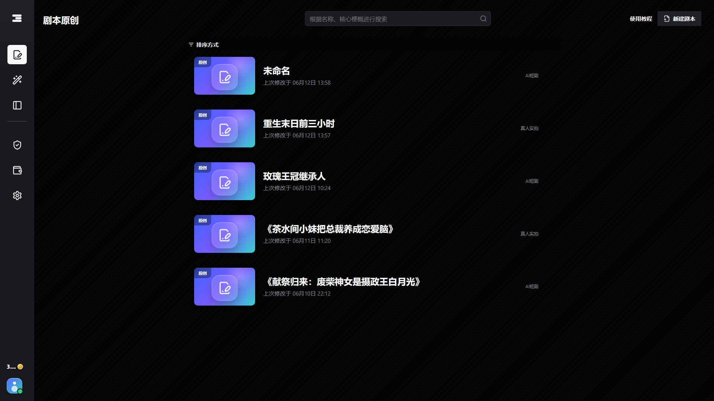
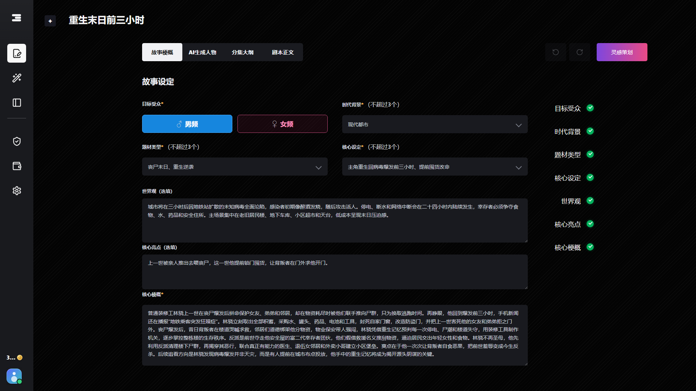
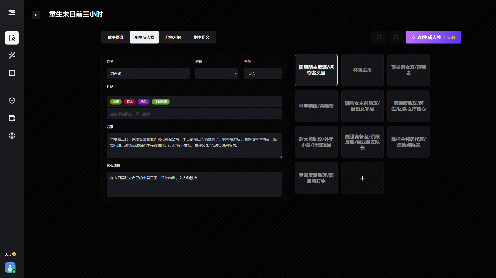
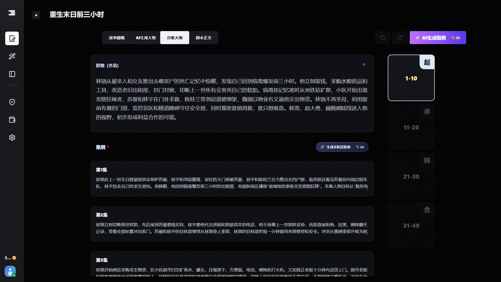
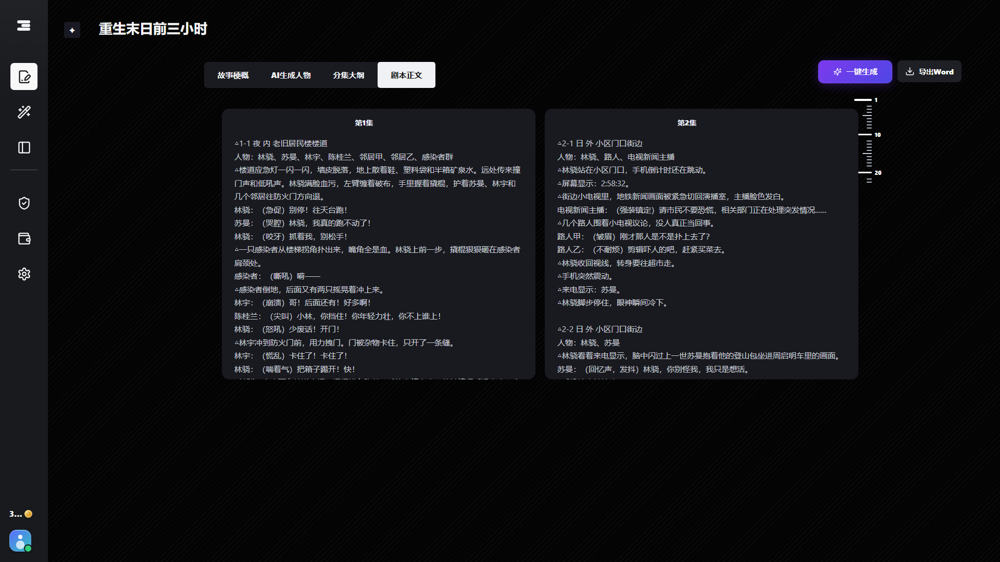
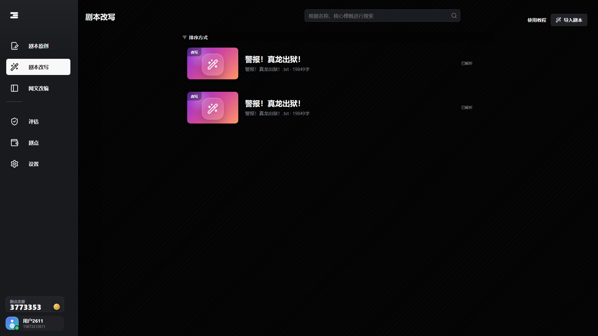
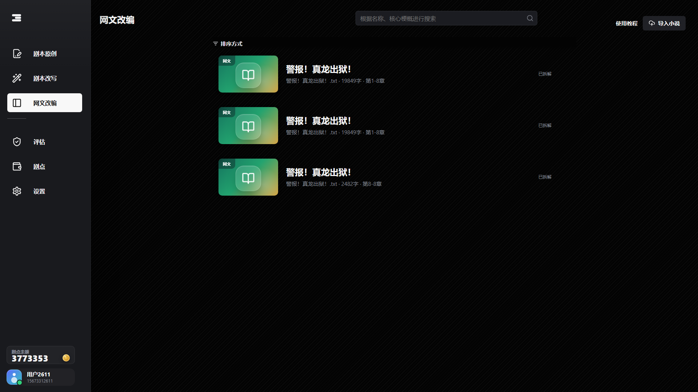

# 妙喵剧本 AI 创作平台

<div align="center">

本项目是一个本地优先的 AI 短剧剧本创作工作台，覆盖原创剧本、剧本改写、小说改编、分集大纲、正文生成、Word 导出、钱包展示和本地 API 配置等完整流程。

<br />

<strong>项目咨询 / 合作 / 定制开发</strong>

<h2>微信：soe303</h2>

<br />



</div>

## 项目亮点

| 能力 | 说明 |
| --- | --- |
| 本地优先 | 剧本草稿、生成内容、项目配置和数据默认保存在本机，方便私有化使用。 |
| 原创剧本 | 支持故事设定、角色小传、阶段大纲、分集大纲、正文生成等完整创作链路。 |
| AI 流式生成 | 角色、大纲、分集和正文均支持流式生成，生成过程可视化反馈更及时。 |
| 改写与改编 | 提供剧本改写、网文改编入口，可通过上传文本快速创建项目。 |
| 编辑与导出 | 正文编辑器支持分集卡片、批量生成区间、展开模式、自动滚动和 Word 导出。 |
| 商业化 UI | 内置钱包、积分、会员、充值、额度展示等产品界面，便于二次开发和演示。 |
| API 可配置 | 支持 OpenAI 兼容接口，可在页面中配置 API 地址、模型和 Key。 |

## 界面预览

### 创作工作台


### 故事设定



### 角色小传



### 分集大纲



### 剧本文本编辑器



### 改写与改编项目列表





## 技术栈

| 模块 | 技术 |
| --- | --- |
| 前端 | Vue 3、Vite、lucide-vue-next |
| 后端 | Go HTTP Server |
| 数据 | MySQL |
| AI 接入 | OpenAI 兼容的 Chat Completions / Responses 风格接口 |

## 快速启动

### 1. 启动后端

```powershell
cd backend
go run .
```

后端默认监听：

```text
http://localhost:19180
```

### 2. 启动前端

```powershell
cd frontend
npm install
npm run dev
```

浏览器打开：

```text
http://localhost:5173
```

## 数据库配置

项目通过根目录 `.env` 读取本地 MySQL 配置。开发时通常只需要改 `DB_PASSWORD`，如果你的库名不是默认值，再改 `DB_NAME`。

- `DB_HOST`
- `DB_PORT`
- `DB_USER`
- `DB_PASSWORD`
- `DB_NAME`

如果你已经有完整 DSN，也可以直接设置：

```text
DB_DSN=user:pass@tcp(127.0.0.1:3306)/miao_muse?parseTime=true&charset=utf8mb4
```

`.env.example` 已提供模板，`.env` 用于本机实际配置。

首次使用前需要先在 MySQL 中创建数据库，程序启动后会自动创建业务表：

```sql
CREATE DATABASE IF NOT EXISTS miao_muse CHARACTER SET utf8mb4 COLLATE utf8mb4_unicode_ci;
```

如果你确认 `.env` 里的账号有 `CREATE DATABASE` 权限，也可以临时设置 `DB_CREATE_DATABASE=true`，让程序启动时尝试创建数据库。

## AI 配置

项目不内置生产 API Key，需要使用你自己的大模型服务。直接在页面配置：

进入应用后打开：

```text
设置 -> API 配置
```

填写以下内容：

- API 地址：例如 `https://api.openai.com/v1`
- 模型：例如 `gpt-4o-mini`
- API Key：你的服务商密钥

页面保存的 API 配置会写入 `ai-config.local.json`，该文件已被 Git 忽略，避免误提交密钥。

## Linux 打包

运行 Windows 打包脚本，脚本会重新构建前端、刷新后端内嵌资源、运行后端测试，再生成 Linux 二进制：

```bat
build-linux.bat
```

产物默认输出到：

```text
dist/miaoMuse
```

运行时会自动读取根目录 `.env`，并内嵌 `frontend/dist` 作为静态页面资源。

## 常用命令

| 操作 | 命令 |
| --- | --- |
| 构建前端 | `cd frontend && npm run build` |
| 构建后端 | `cd backend && go build ./...` |
| 构建 Linux 二进制 | `build-linux.bat` |
| 运行后端测试 | `cd backend && go test ./...` |

PowerShell 中也可以分两行执行：

```powershell
cd frontend
npm run build
```

```powershell
cd backend
go build ./...
```

```powershell
cd backend
go test ./...
```

## 项目目录

```text
backend/      Go 后端服务、接口、AI 任务编排和本地数据读写
frontend/     Vue 3 前端应用
docs/         产品说明、系统设计、业务逻辑和参考文档
screenshots/  项目截图和 README 预览图
scripts/      文档与参考资源生成脚本
```

## 本地文件与安全说明

以下运行时文件和敏感文件已被 `.gitignore` 忽略：

- `api.txt`
- `ai-config.local.json`
- `*.local.json`
- `backend/web/dist/`
- `backend/*.exe`
- `frontend/dist/`
- `frontend/node_modules/`
- `logs/`
- `test-results/`

`api.example.txt` 仅作为格式示例，不要提交真实 API Key。

## 说明

这是一个本地优先的短剧 AI 创作工具。钱包余额、会员、充值、额度等模块主要用于产品界面展示和本地模拟，未接入真实支付系统。需要私有化部署、功能定制或商业化改造，可以通过微信 `soe303` 联系。
