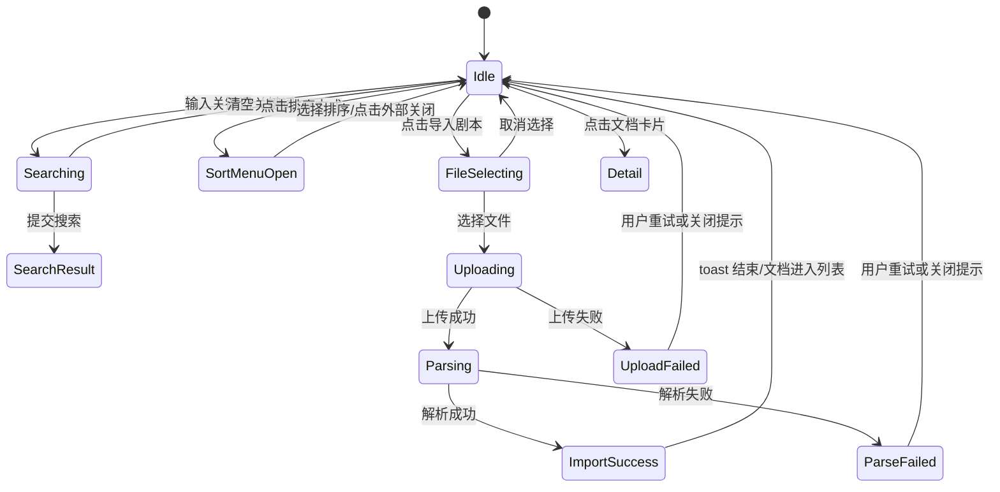
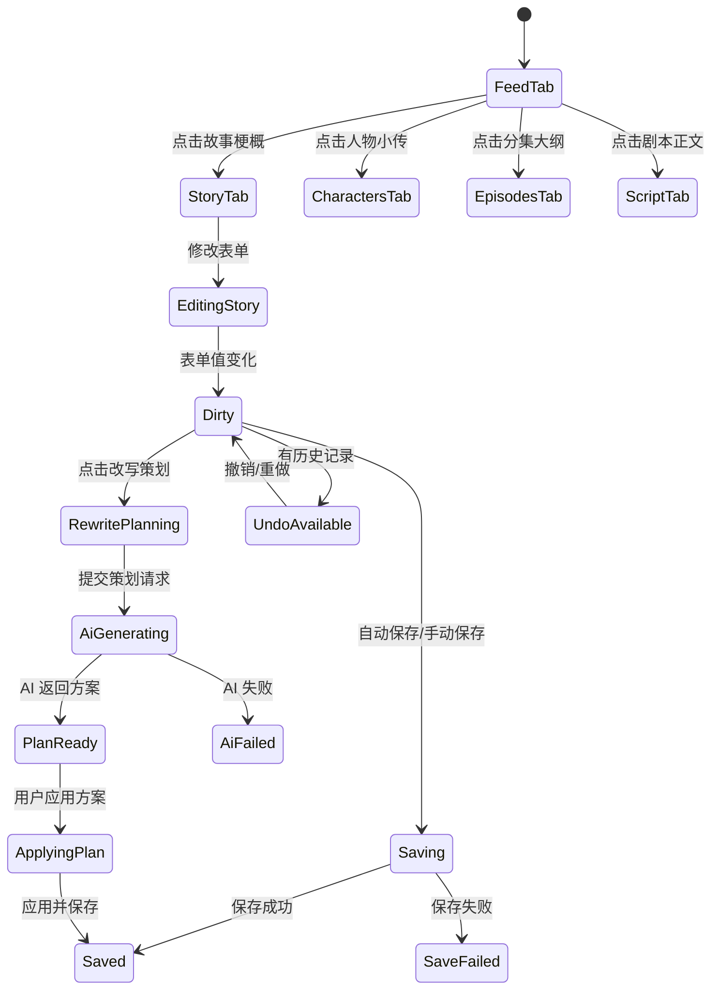

下面给出一套“功能与布局逻辑保留、视觉资源重新实现”的 Vue 页面方案。不会复用截图中的品牌 Logo、头像、机器人图标等资源，仅用占位图形、CSS 图标或通用 SVG/Unicode 代替。

---

# 1. 页面结构理解与改写目标

该界面可以拆成两个核心页面：

1. **脚本改写列表页**
   - 左侧固定导航栏。
   - 主区域黑色斜纹背景。
   - 顶部标题：`剧本改写`
   - 中间搜索框。
   - 右上角：使用教程、导入剧本按钮。
   - 内容区：排序入口、脚本文档卡片。
   - 右下角：AI 助手悬浮按钮。
   - 导入时存在上传中/上传完成状态，但截图里差异较小，可通过按钮 loading、toast、文件解析状态体现。

2. **脚本详情/改写工作台**
   - 左侧固定导航栏保留。
   - 主内容顶部：文档标题。
   - 页签：信息流、故事梗概、人物小传、分集大纲、剧本正文。
   - 信息流页：展示 AI 提取出的故事概览、人物设定等卡片。
   - 故事设定页：表单化编辑故事参数，右侧步骤锚点，右上角撤销/重做/改写策划按钮。

---

# 2. Vue HTML Skeleton

以下示例使用 Vue 3 Composition API，可直接拆成组件。

## 2.1 App.vue

```vue
<template>
  <div class="app-shell">
    <SideNav
      :active="activeNav"
      :quota="user.quota"
      :avatar-url="user.avatarUrl"
      @nav-change="activeNav = $event"
    />

    <main class="workspace">
      <RouterView />
    </main>
  </div>
</template>

<script setup>
import { ref } from 'vue'
import SideNav from './components/SideNav.vue'

const activeNav = ref('rewrite')

const user = {
  quota: 463,
  avatarUrl: ''
}
</script>
```

---

## 2.2 components/SideNav.vue

```vue
<template>
  <aside class="side-nav">
    <div class="side-nav__brand" aria-label="App Logo">
      <span class="brand-mark">A</span>
    </div>

    <nav class="side-nav__menu">
      <button
        v-for="item in topItems"
        :key="item.key"
        class="side-nav__item"
        :class="{ 'is-active': active === item.key }"
        @click="$emit('nav-change', item.key)"
      >
        <span class="side-nav__icon">{{ item.icon }}</span>
      </button>

      <div class="side-nav__divider"></div>

      <button
        v-for="item in bottomItems"
        :key="item.key"
        class="side-nav__item"
        :class="{ 'is-active': active === item.key }"
        @click="$emit('nav-change', item.key)"
      >
        <span class="side-nav__icon">{{ item.icon }}</span>
      </button>
    </nav>

    <div class="side-nav__footer">
      <div class="quota">
        <strong>{{ quota }}</strong>
        <small>点</small>
      </div>
      <button class="avatar" aria-label="用户头像">
        <span v-if="!avatarUrl">U</span>
        
      </button>
    </div>
  </aside>
</template>

<script setup>
defineProps({
  active: {
    type: String,
    default: 'rewrite'
  },
  quota: {
    type: Number,
    default: 0
  },
  avatarUrl: {
    type: String,
    default: ''
  }
})

defineEmits(['nav-change'])

const topItems = [
  { key: 'docs', icon: '▱' },
  { key: 'rewrite', icon: '✕' },
  { key: 'library', icon: '▥' }
]

const bottomItems = [
  { key: 'safe', icon: '♜' },
  { key: 'hot', icon: '♨' },
  { key: 'vip', icon: '◇' },
  { key: 'wallet', icon: '▣' },
  { key: 'team', icon: '♟' },
  { key: 'settings', icon: '⚙' }
]
</script>
```

---

## 2.3 views/RewriteHome.vue：列表页

对应截图：

- `target-rewrite-01-initial.png`
- `target-rewrite-02-uploading.png`
- `target-rewrite-03-after-upload.png`

```vue
<template>
  <section class="page page--home">
    <header class="home-header">
      <h1 class="page-title">剧本改写</h1>

      <SearchBox
        v-model="query"
        placeholder="根据名称、核心梗概进行搜索"
        @search="handleSearch"
      />

      <div class="home-header__actions">
        <button class="text-link" @click="openGuide">使用教程</button>

        <FileImportButton
          :loading="uploadState === 'uploading' || uploadState === 'parsing'"
          @file-selected="handleFileSelected"
        />
      </div>
    </header>

    <div class="home-toolbar">
      <button class="sort-button" @click="toggleSortMenu">
        <span>☰</span>
        <span>排序方式</span>
      </button>

      <div v-if="sortMenuVisible" class="sort-popover">
        <button @click="setSort('updated_desc')">最近修改优先</button>
        <button @click="setSort('created_desc')">最近创建优先</button>
        <button @click="setSort('name_asc')">名称升序</button>
      </div>
    </div>

    <section class="doc-list" :class="{ 'is-empty': filteredDocs.length === 0 }">
      <article
        v-for="doc in filteredDocs"
        :key="doc.id"
        class="doc-card"
        @click="goDetail(doc.id)"
      >
        <div class="doc-card__cover">
          <span class="doc-card__tag">{{ doc.sourceTypeLabel }}</span>
          <div class="cover-shape cover-shape--one"></div>
          <div class="cover-shape cover-shape--two"></div>
        </div>

        <div class="doc-card__body">
          <h2>{{ doc.title }}</h2>
          <p>上次修改于 {{ doc.updatedText }}</p>

          <div
            v-if="doc.processStatus !== 'ready'"
            class="doc-card__status"
            :class="`is-${doc.processStatus}`"
          >
            <span class="mini-spinner" v-if="doc.processStatus === 'uploading' || doc.processStatus === 'parsing'"></span>
            <span>{{ statusText(doc.processStatus) }}</span>
          </div>
        </div>
      </article>

      <div v-if="filteredDocs.length === 0" class="empty-state">
        <div class="empty-state__icon">✦</div>
        <p>暂无符合条件的剧本</p>
      </div>
    </section>

    <AiAssistantButton @click="openAssistant" />

    <ToastLayer :items="toasts" @close="removeToast" />
  </section>
</template>

<script setup>
import { computed, ref } from 'vue'
import { useRouter } from 'vue-router'
import SearchBox from '../components/SearchBox.vue'
import FileImportButton from '../components/FileImportButton.vue'
import AiAssistantButton from '../components/AiAssistantButton.vue'
import ToastLayer from '../components/ToastLayer.vue'

const router = useRouter()

const query = ref('')
const sort = ref('updated_desc')
const sortMenuVisible = ref(false)
const uploadState = ref('idle')
const toasts = ref([])

const docs = ref([
  {
    id: 'doc_001',
    title: '新建 DOCX 文档',
    sourceType: 'live',
    sourceTypeLabel: '实拍',
    updatedAt: '2024-06-07T10:08:00+08:00',
    updatedText: '06月07日 10:08',
    processStatus: 'ready'
  }
])

const filteredDocs = computed(() => {
  const keyword = query.value.trim().toLowerCase()

  let list = docs.value.filter((doc) => {
    if (!keyword) return true
    return doc.title.toLowerCase().includes(keyword)
  })

  return list.sort((a, b) => {
    if (sort.value === 'name_asc') return a.title.localeCompare(b.title)
    return new Date(b.updatedAt) - new Date(a.updatedAt)
  })
})

function handleSearch() {}

function toggleSortMenu() {
  sortMenuVisible.value = !sortMenuVisible.value
}

function setSort(nextSort) {
  sort.value = nextSort
  sortMenuVisible.value = false
}

function openGuide() {
  pushToast('使用教程弹窗可在此打开')
}

function openAssistant() {
  pushToast('AI 助手已打开')
}

async function handleFileSelected(file) {
  uploadState.value = 'uploading'

  const tempDoc = {
    id: `doc_${Date.now()}`,
    title: file.name.replace(/\.(docx|doc|txt)$/i, '') || '未命名文档',
    sourceType: 'uploaded',
    sourceTypeLabel: '导入',
    updatedAt: new Date().toISOString(),
    updatedText: '刚刚',
    processStatus: 'uploading'
  }

  docs.value.unshift(tempDoc)

  try {
    await mockDelay(900)
    tempDoc.processStatus = 'parsing'
    uploadState.value = 'parsing'

    await mockDelay(1200)
    tempDoc.processStatus = 'ready'
    uploadState.value = 'success'

    pushToast('剧本导入成功')
  } catch (error) {
    tempDoc.processStatus = 'failed'
    uploadState.value = 'failed'
    pushToast('导入失败，请重试', 'error')
  } finally {
    setTimeout(() => {
      uploadState.value = 'idle'
    }, 1000)
  }
}

function goDetail(id) {
  router.push(`/rewrite/${id}/feed`)
}

function statusText(status) {
  const map = {
    uploading: '上传中',
    parsing: '解析中',
    failed: '处理失败'
  }
  return map[status] || ''
}

function pushToast(message, type = 'info') {
  toasts.value.push({
    id: Date.now(),
    message,
    type
  })
}

function removeToast(id) {
  toasts.value = toasts.value.filter((item) => item.id !== id)
}

function mockDelay(ms) {
  return new Promise((resolve) => setTimeout(resolve, ms))
}
</script>
```

---

## 2.4 components/SearchBox.vue

```vue
<template>
  <form class="search-box" @submit.prevent="$emit('search', modelValue)">
    <input
      :value="modelValue"
      :placeholder="placeholder"
      @input="$emit('update:modelValue', $event.target.value)"
    />
    <button type="submit" aria-label="搜索">
      ⌕
    </button>
  </form>
</template>

<script setup>
defineProps({
  modelValue: {
    type: String,
    default: ''
  },
  placeholder: {
    type: String,
    default: '搜索'
  }
})

defineEmits(['update:modelValue', 'search'])
</script>
```

---

## 2.5 components/FileImportButton.vue

```vue
<template>
  <label class="import-button" :class="{ 'is-loading': loading }">
    <input
      type="file"
      accept=".doc,.docx,.txt"
      :disabled="loading"
      @change="onChange"
    />
    <span class="import-button__icon">
      <span v-if="loading" class="mini-spinner"></span>
      <span v-else>⇪</span>
    </span>
    <span>{{ loading ? '导入中' : '导入剧本' }}</span>
  </label>
</template>

<script setup>
defineProps({
  loading: {
    type: Boolean,
    default: false
  }
})

const emit = defineEmits(['file-selected'])

function onChange(event) {
  const file = event.target.files?.[0]
  if (file) emit('file-selected', file)
  event.target.value = ''
}
</script>
```

---

## 2.6 components/AiAssistantButton.vue

```vue
<template>
  <button class="ai-float" @click="$emit('click')" aria-label="打开 AI 助手">
    <span class="ai-float__antenna"></span>
    <span class="ai-float__face">
      <i></i>
      <i></i>
    </span>
  </button>
</template>

<script setup>
defineEmits(['click'])
</script>
```

---

## 2.7 views/RewriteDetail.vue：详情工作台父页面

```vue
<template>
  <section class="page page--detail">
    <header class="detail-header">
      <div class="detail-title">
        <span class="detail-title__icon">✦</span>
        <h1>{{ doc.title }}</h1>
      </div>
    </header>

    <div class="detail-tabs-row">
      <TabNav
        :tabs="tabs"
        :active="activeTab"
        @change="handleTabChange"
      />

      <div class="detail-actions">
        <template v-if="activeTab === 'feed'">
          <button class="ghost-button" @click="copyCitation">
            <span>▣</span>
            <span>一键引用</span>
          </button>
        </template>

        <template v-else>
          <button class="icon-button" :disabled="!canUndo" @click="undo">↶</button>
          <button class="icon-button" :disabled="!canRedo" @click="redo">↷</button>
          <button class="gradient-button" @click="openRewritePlan">
            <span>♢</span>
            <span>改写策划</span>
          </button>
        </template>
      </div>
    </div>

    <RouterView
      :doc="doc"
      :feed="feed"
      :story-form="storyForm"
      @update:story-form="storyForm = $event"
    />
  </section>
</template>

<script setup>
import { computed, ref } from 'vue'
import { useRoute, useRouter } from 'vue-router'
import TabNav from '../components/TabNav.vue'

const route = useRoute()
const router = useRouter()

const doc = ref({
  id: route.params.id,
  title: '新建 DOCX 文档'
})

const tabs = [
  { key: 'feed', label: '信息流', path: 'feed' },
  { key: 'story', label: '故事梗概', path: 'story' },
  { key: 'characters', label: '人物小传', path: 'characters' },
  { key: 'episodes', label: '分集大纲', path: 'episodes' },
  { key: 'script', label: '剧本正文', path: 'script' }
]

const activeTab = computed(() => route.name?.toString().replace('rewrite-', '') || 'feed')

const canUndo = ref(false)
const canRedo = ref(false)

const feed = ref({
  overview: {
    targetAudience: '女频',
    era: '古代',
    genre: '宅斗',
    coreSettings: ['真假千金', '逆袭', '虐恋', '大女主', '重生'],
    background: '在等级森严、以灵脉天赋论尊卑的古代世家社会中，嫡庶有别是铁律...',
    highlight: '重生嫡女从灵脉闭塞的“废物”逆袭为隐藏大佬...',
    synopsis: '在灵脉天赋决定一切的世家，女主被亲族视为弃子，受尽冷眼...'
  },
  characters: [
    {
      name: '苏明远',
      age: 45,
      description: '苏家家主，注重家族颜面和天赋出众的后辈。'
    },
    {
      name: '苏婉儿',
      age: 16,
      description: '骄纵、虚伪、心机深沉，受人宠爱却暗藏算计。'
    }
  ]
})

const storyForm = ref({
  audience: '',
  era: [],
  genre: [],
  coreSettings: [],
  background: '',
  highlight: '',
  synopsis: ''
})

function handleTabChange(tab) {
  router.push(`/rewrite/${doc.value.id}/${tab.path}`)
}

function copyCitation() {}

function undo() {}

function redo() {}

function openRewritePlan() {}
</script>
```

---

## 2.8 components/TabNav.vue

```vue
<template>
  <nav class="tab-nav">
    <button
      v-for="tab in tabs"
      :key="tab.key"
      class="tab-nav__item"
      :class="{ 'is-active': active === tab.key }"
      @click="$emit('change', tab)"
    >
      {{ tab.label }}
    </button>
  </nav>
</template>

<script setup>
defineProps({
  tabs: {
    type: Array,
    required: true
  },
  active: {
    type: String,
    required: true
  }
})

defineEmits(['change'])
</script>
```

---

## 2.9 views/InfoFeedView.vue

对应截图：`target-rewrite-04-info-feed.png`

```vue
<template>
  <div class="feed-page">
    <section class="content-card">
      <h2>故事梗概</h2>

      <div class="summary-grid">
        <div>
          <strong>目标受众</strong>
          <span>{{ feed.overview.targetAudience }}</span>
        </div>
        <div>
          <strong>时代背景</strong>
          <span>{{ feed.overview.era }}</span>
        </div>
        <div>
          <strong>题材类型</strong>
          <span>{{ feed.overview.genre }}</span>
        </div>
        <div>
          <strong>核心设定</strong>
          <span>{{ feed.overview.coreSettings.join('、') }}</span>
        </div>
      </div>

      <article class="text-block">
        <h3>故事背景</h3>
        <p>{{ feed.overview.background }}</p>
      </article>

      <article class="text-block">
        <h3>核心亮点</h3>
        <p>{{ feed.overview.highlight }}</p>
      </article>

      <article class="text-block">
        <h3>核心梗概</h3>
        <p>{{ feed.overview.synopsis }}</p>
      </article>
    </section>

    <section class="content-card">
      <h2>人物设定</h2>

      <div
        v-for="character in feed.characters"
        :key="character.name"
        class="character-row"
      >
        <h3>
          {{ character.name }}
          <span>{{ character.age }}岁</span>
        </h3>
        <p>{{ character.description }}</p>
      </div>
    </section>
  </div>
</template>

<script setup>
defineProps({
  doc: {
    type: Object,
    required: true
  },
  feed: {
    type: Object,
    required: true
  }
})
</script>
```

---

## 2.10 views/StorySettingsView.vue

对应截图：`target-rewrite-05-story-settings.png`

```vue
<template>
  <div class="story-settings-page">
    <form class="story-form" @submit.prevent="submitForm">
      <h2>故事设定</h2>

      <div class="form-grid">
        <fieldset class="form-field">
          <legend>
            目标受众
            <em>*</em>
          </legend>

          <div class="segmented">
            <button
              type="button"
              :class="{ 'is-selected is-blue': localForm.audience === '男频' }"
              @click="localForm.audience = '男频'"
            >
              ♂ 男频
            </button>
            <button
              type="button"
              :class="{ 'is-selected is-gold': localForm.audience === '女频' }"
              @click="localForm.audience = '女频'"
            >
              ♀ 女频
            </button>
          </div>
        </fieldset>

        <FieldSelect
          v-model="localForm.era"
          label="时代背景"
          required
          max="3"
          placeholder="选择或自定义输入背景"
          :options="eraOptions"
        />

        <FieldSelect
          v-model="localForm.genre"
          label="题材类型"
          required
          max="3"
          placeholder="选择或自定义输入类型"
          :options="genreOptions"
        />

        <FieldSelect
          v-model="localForm.coreSettings"
          label="核心设定"
          required
          max="5"
          placeholder="选择或自定义输入设定"
          :options="settingOptions"
        />

        <label class="form-field form-field--full">
          <span>故事背景（选填）</span>
          <input
            v-model="localForm.background"
            placeholder="例：1932年，伪满洲国成立前夕的北平。表面繁华依旧，实则暗流涌动..."
          />
        </label>

        <label class="form-field form-field--full">
          <span>核心亮点（选填）</span>
          <input
            v-model="localForm.highlight"
            placeholder="例：穿书成作死女配，她反向操作，用沙雕和直球硬核攻略哑巴老公..."
          />
        </label>

        <label class="form-field form-field--full">
          <span>
            核心梗概
            <em>*</em>
          </span>
          <textarea
            v-model="localForm.synopsis"
            rows="5"
          ></textarea>
        </label>
      </div>
    </form>

    <aside class="step-anchor">
      <button
        v-for="step in steps"
        :key="step.key"
        :class="{ 'is-current': currentStep === step.key }"
        @click="scrollTo(step.key)"
      >
        <span class="step-anchor__dot"></span>
        <span>{{ step.label }}</span>
      </button>
    </aside>
  </div>
</template>

<script setup>
import { reactive, watch, ref } from 'vue'
import FieldSelect from '../components/FieldSelect.vue'

const props = defineProps({
  storyForm: {
    type: Object,
    required: true
  }
})

const emit = defineEmits(['update:story-form'])

const localForm = reactive({
  audience: props.storyForm.audience,
  era: [...props.storyForm.era],
  genre: [...props.storyForm.genre],
  coreSettings: [...props.storyForm.coreSettings],
  background: props.storyForm.background,
  highlight: props.storyForm.highlight,
  synopsis: props.storyForm.synopsis
})

const currentStep = ref('audience')

const steps = [
  { key: 'audience', label: '目标受众' },
  { key: 'era', label: '时代背景' },
  { key: 'genre', label: '题材类型' },
  { key: 'coreSettings', label: '核心设定' },
  { key: 'background', label: '故事背景' },
  { key: 'highlight', label: '核心亮点' },
  { key: 'synopsis', label: '核心梗概' }
]

const eraOptions = ['古代', '现代', '民国', '架空', '未来']
const genreOptions = ['宅斗', '甜宠', '悬疑', '权谋', '都市']
const settingOptions = ['真假千金', '逆袭', '重生', '先婚后爱', '追妻火葬场']

watch(
  localForm,
  () => {
    emit('update:story-form', {
      audience: localForm.audience,
      era: localForm.era,
      genre: localForm.genre,
      coreSettings: localForm.coreSettings,
      background: localForm.background,
      highlight: localForm.highlight,
      synopsis: localForm.synopsis
    })
  },
  { deep: true }
)

function submitForm() {}

function scrollTo(key) {
  currentStep.value = key
}
</script>
```

---

## 2.11 components/FieldSelect.vue

```vue
<template>
  <label class="form-field">
    <span>
      {{ label }}
      <em v-if="required">*</em>
      <small v-if="max">（不超过{{ max }}个）</small>
    </span>

    <div class="select-shell">
      <select @change="addValue($event.target.value)">
        <option value="">{{ placeholder }}</option>
        <option
          v-for="option in options"
          :key="option"
          :value="option"
        >
          {{ option }}
        </option>
      </select>
      <span class="select-shell__arrow">⌄</span>
    </div>

    <div v-if="modelValue.length" class="tag-list">
      <button
        v-for="item in modelValue"
        :key="item"
        type="button"
        class="tag"
        @click="removeValue(item)"
      >
        {{ item }} ×
      </button>
    </div>
  </label>
</template>

<script setup>
const props = defineProps({
  modelValue: {
    type: Array,
    default: () => []
  },
  label: {
    type: String,
    required: true
  },
  required: {
    type: Boolean,
    default: false
  },
  max: {
    type: [String, Number],
    default: ''
  },
  placeholder: {
    type: String,
    default: '请选择'
  },
  options: {
    type: Array,
    default: () => []
  }
})

const emit = defineEmits(['update:modelValue'])

function addValue(value) {
  if (!value) return

  const max = Number(props.max || 999)
  const next = [...props.modelValue]

  if (!next.includes(value) && next.length < max) {
    next.push(value)
    emit('update:modelValue', next)
  }
}

function removeValue(value) {
  emit(
    'update:modelValue',
    props.modelValue.filter((item) => item !== value)
  )
}
</script>
```

---

# 3. CSS 结构说明

## 3.1 全局变量与基础布局

```css
:root {
  --sidebar-w: 108px;
  --bg-page: #050505;
  --bg-panel: #18191d;
  --bg-panel-2: #1d1f24;
  --bg-sidebar: #191a1e;

  --text-main: #f6f7fb;
  --text-sub: #a9adb8;
  --text-muted: #697081;

  --line-soft: rgba(255, 255, 255, 0.08);
  --line-strong: rgba(255, 255, 255, 0.16);

  --radius-page: 28px;
  --radius-card: 14px;
  --radius-control: 8px;

  --accent-blue: #45aaff;
  --accent-cyan: #62e4d1;
  --accent-purple: #7867ff;
  --accent-pink: #e85c8a;
  --accent-gold: #f2bd37;

  --shadow-soft: 0 18px 60px rgba(0, 0, 0, 0.35);
  --font-sans: -apple-system, BlinkMacSystemFont, "Segoe UI", "PingFang SC",
    "Microsoft YaHei", Arial, sans-serif;
}

* {
  box-sizing: border-box;
}

html,
body,
#app {
  width: 100%;
  min-height: 100%;
  margin: 0;
  background: #000;
  color: var(--text-main);
  font-family: var(--font-sans);
}

button,
input,
textarea,
select {
  font: inherit;
}

button {
  cursor: pointer;
}
```

---

## 3.2 应用外壳与斜纹背景

```css
.app-shell {
  min-height: 100vh;
  display: flex;
  background: #000;
}

.workspace {
  flex: 1;
  min-width: 0;
  padding-left: var(--sidebar-w);
}

.page {
  min-height: 100vh;
  position: relative;
  padding: 38px 58px;
  overflow: hidden;
  border-top-left-radius: var(--radius-page);
  border-bottom-left-radius: var(--radius-page);
  background:
    repeating-linear-gradient(
      135deg,
      rgba(255, 255, 255, 0.035) 0,
      rgba(255, 255, 255, 0.035) 1px,
      transparent 1px,
      transparent 6px
    ),
    var(--bg-page);
}

.page--detail {
  overflow-y: auto;
}
```

---

## 3.3 侧边栏

```css
.side-nav {
  width: var(--sidebar-w);
  height: 100vh;
  position: fixed;
  inset: 0 auto 0 0;
  z-index: 20;
  background: var(--bg-sidebar);
  display: flex;
  flex-direction: column;
  align-items: center;
  padding: 48px 0 24px;
}

.side-nav__brand {
  margin-bottom: 58px;
}

.brand-mark {
  display: grid;
  place-items: center;
  width: 42px;
  height: 28px;
  font-size: 24px;
  font-weight: 900;
  letter-spacing: -2px;
}

.side-nav__menu {
  display: flex;
  flex-direction: column;
  align-items: center;
  gap: 18px;
}

.side-nav__item {
  width: 58px;
  height: 56px;
  border: 0;
  border-radius: 8px;
  background: transparent;
  color: #fff;
  display: grid;
  place-items: center;
  font-size: 24px;
}

.side-nav__item.is-active {
  background: #f3f3f3;
  color: #050505;
}

.side-nav__divider {
  width: 58px;
  height: 1px;
  margin: 4px 0 18px;
  background: var(--line-strong);
}

.side-nav__footer {
  margin-top: auto;
  display: grid;
  justify-items: center;
  gap: 18px;
}

.quota {
  color: #d9d9df;
}

.quota strong {
  font-size: 24px;
  line-height: 1;
}

.quota small {
  margin-left: 2px;
  color: var(--text-sub);
}

.avatar {
  width: 44px;
  height: 44px;
  border-radius: 50%;
  border: 1px solid var(--line-strong);
  background: radial-gradient(circle at 35% 30%, #e1a95d, #2a2c32 65%);
  color: white;
  overflow: hidden;
}

.avatar img {
  width: 100%;
  height: 100%;
  object-fit: cover;
}
```

---

## 3.4 列表页 Header / 搜索 / 导入

```css
.home-header {
  display: grid;
  grid-template-columns: 1fr minmax(360px, 450px) 1fr;
  align-items: center;
  column-gap: 32px;
}

.page-title {
  margin: 0;
  font-size: 30px;
  line-height: 1.2;
  font-weight: 800;
}

.search-box {
  height: 50px;
  display: flex;
  align-items: center;
  background: var(--bg-panel);
  border-radius: 5px;
  border: 1px solid var(--line-soft);
}

.search-box input {
  flex: 1;
  min-width: 0;
  height: 100%;
  padding: 0 14px;
  border: 0;
  outline: none;
  background: transparent;
  color: var(--text-main);
  font-size: 18px;
}

.search-box input::placeholder {
  color: #7d8492;
}

.search-box button {
  width: 42px;
  height: 34px;
  margin-right: 8px;
  border-radius: 8px;
  border: 1px solid var(--line-strong);
  background: transparent;
  color: var(--text-sub);
  font-size: 22px;
}

.home-header__actions {
  display: flex;
  justify-content: flex-end;
  align-items: center;
  gap: 28px;
}

.text-link {
  border: 0;
  background: transparent;
  color: #fff;
  font-weight: 600;
}

.import-button {
  height: 50px;
  padding: 0 20px;
  display: inline-flex;
  align-items: center;
  gap: 10px;
  border-radius: 6px;
  background: var(--bg-panel);
  color: #fff;
  font-weight: 700;
}

.import-button input {
  display: none;
}

.import-button.is-loading {
  opacity: 0.75;
  pointer-events: none;
}
```

---

## 3.5 文档列表卡片

```css
.home-toolbar {
  position: relative;
  margin-top: 26px;
  margin-left: 106px;
}

.sort-button {
  display: inline-flex;
  gap: 8px;
  align-items: center;
  color: #fff;
  border: 0;
  background: transparent;
  font-weight: 700;
  font-size: 17px;
}

.sort-popover {
  position: absolute;
  left: 0;
  top: 34px;
  width: 160px;
  padding: 8px;
  border-radius: 10px;
  background: var(--bg-panel-2);
  box-shadow: var(--shadow-soft);
  z-index: 5;
}

.sort-popover button {
  width: 100%;
  padding: 10px;
  border: 0;
  border-radius: 6px;
  background: transparent;
  color: var(--text-main);
  text-align: left;
}

.sort-popover button:hover {
  background: rgba(255, 255, 255, 0.08);
}

.doc-list {
  margin-top: 70px;
  padding-left: 176px;
}

.doc-card {
  width: 520px;
  display: flex;
  align-items: center;
  gap: 20px;
  border-radius: 14px;
  cursor: pointer;
}

.doc-card__cover {
  position: relative;
  width: 150px;
  height: 112px;
  flex: none;
  border-radius: 14px;
  overflow: hidden;
  background:
    radial-gradient(circle at 80% 80%, #fff 0, #fff8c8 22%, transparent 55%),
    radial-gradient(circle at 30% 45%, #ff8c7d 0, #ffc7aa 32%, transparent 60%),
    linear-gradient(135deg, #d14a88, #ffe879);
}

.doc-card__tag {
  position: absolute;
  top: 12px;
  left: 12px;
  z-index: 2;
  font-size: 14px;
  font-weight: 700;
}

.cover-shape {
  position: absolute;
  border: 1px solid rgba(255, 255, 255, 0.35);
}

.cover-shape--one {
  width: 44px;
  height: 44px;
  left: 38%;
  top: 30%;
}

.cover-shape--two {
  width: 34px;
  height: 34px;
  left: 46%;
  top: 18%;
  background: rgba(255, 255, 255, 0.14);
  border: 0;
}

.doc-card__body h2 {
  margin: 0 0 10px;
  font-size: 22px;
  line-height: 1.2;
}

.doc-card__body p {
  margin: 0;
  color: var(--text-sub);
}

.doc-card__status {
  margin-top: 10px;
  color: var(--text-sub);
  display: flex;
  align-items: center;
  gap: 8px;
}

.doc-card__status.is-failed {
  color: #ff6f6f;
}
```

---

## 3.6 AI 悬浮按钮

```css
.ai-float {
  position: fixed;
  right: 62px;
  bottom: 72px;
  width: 62px;
  height: 52px;
  border: 0;
  background: transparent;
  z-index: 10;
}

.ai-float__face {
  position: relative;
  width: 56px;
  height: 38px;
  display: flex;
  justify-content: center;
  gap: 10px;
  align-items: center;
  border-radius: 20px;
  background: linear-gradient(135deg, #7f5cff, #4b2ee6);
  box-shadow: 0 0 20px rgba(114, 86, 255, 0.85);
}

.ai-float__face::after {
  content: "";
  position: absolute;
  right: -4px;
  bottom: 1px;
  width: 10px;
  height: 14px;
  border-radius: 0 0 10px 0;
  border-right: 3px solid #6f55ff;
  border-bottom: 3px solid #6f55ff;
}

.ai-float__face i {
  width: 8px;
  height: 8px;
  background: #fff;
  border-radius: 50%;
}

.ai-float__antenna {
  position: absolute;
  left: 31px;
  top: -12px;
  width: 2px;
  height: 16px;
  background: #a884ff;
}

.ai-float__antenna::before {
  content: "";
  position: absolute;
  left: -4px;
  top: -8px;
  width: 10px;
  height: 10px;
  border-radius: 50%;
  background: #a884ff;
}
```

---

## 3.7 详情页页签与操作区

```css
.detail-header {
  margin-bottom: 34px;
}

.detail-title {
  display: flex;
  align-items: center;
  gap: 10px;
}

.detail-title h1 {
  margin: 0;
  font-size: 30px;
  font-weight: 850;
}

.detail-title__icon {
  color: #9f8cff;
}

.detail-tabs-row {
  display: flex;
  align-items: center;
  justify-content: space-between;
  margin-left: 72px;
  margin-right: 46px;
}

.tab-nav {
  display: inline-flex;
  align-items: center;
  background: var(--bg-panel);
  border-radius: 6px;
  overflow: hidden;
}

.tab-nav__item {
  min-width: 106px;
  height: 48px;
  padding: 0 18px;
  color: #fff;
  border: 0;
  background: transparent;
  font-weight: 700;
  font-size: 17px;
}

.tab-nav__item.is-active {
  color: #fff;
  background: linear-gradient(135deg, #8ce88c, #3d99ff);
}

.detail-actions {
  display: flex;
  align-items: center;
  gap: 18px;
}

.ghost-button,
.icon-button {
  height: 48px;
  padding: 0 18px;
  border: 0;
  border-radius: 6px;
  background: rgba(30, 31, 35, 0.8);
  color: var(--text-sub);
}

.icon-button {
  width: 58px;
  font-size: 24px;
}

.gradient-button {
  height: 50px;
  padding: 0 22px;
  display: inline-flex;
  align-items: center;
  gap: 10px;
  border: 0;
  border-radius: 7px;
  background: linear-gradient(135deg, #6657db, #ec5b7e);
  color: white;
  font-weight: 700;
}
```

---

## 3.8 信息流卡片

```css
.feed-page {
  width: min(1280px, calc(100% - 150px));
  margin: 42px auto 0;
  padding-bottom: 80px;
}

.content-card {
  padding: 34px 26px;
  border-radius: var(--radius-card);
  background: var(--bg-panel);
  color: #e5e7ec;
}

.content-card + .content-card {
  margin-top: 20px;
}

.content-card h2 {
  margin: 0 0 22px;
  font-size: 22px;
}

.summary-grid {
  display: grid;
  grid-template-columns: 140px 220px 220px 1fr;
  gap: 30px;
  margin-bottom: 18px;
}

.summary-grid div {
  display: grid;
  gap: 8px;
}

.summary-grid strong,
.text-block h3,
.character-row h3 {
  color: #fff;
  font-size: 17px;
}

.summary-grid span,
.text-block p,
.character-row p {
  color: #cfd2da;
  line-height: 1.8;
}

.text-block {
  margin-top: 12px;
}

.text-block h3 {
  margin: 0 0 4px;
}

.text-block p {
  margin: 0;
}

.character-row + .character-row {
  margin-top: 16px;
}

.character-row h3 {
  margin: 0 0 4px;
}

.character-row h3 span {
  margin-left: 20px;
  color: #cfd2da;
  font-weight: 400;
}
```

---

## 3.9 故事设定表单

```css
.story-settings-page {
  position: relative;
  width: min(1280px, calc(100% - 150px));
  margin: 42px auto 0;
  display: grid;
  grid-template-columns: 1fr 160px;
  gap: 64px;
}

.story-form h2 {
  margin: 0 0 58px;
  font-size: 22px;
}

.form-grid {
  display: grid;
  grid-template-columns: 1fr 1fr;
  gap: 34px 40px;
}

.form-field {
  display: grid;
  gap: 12px;
  border: 0;
  padding: 0;
  margin: 0;
  color: #e8ebf2;
}

.form-field--full {
  grid-column: 1 / -1;
}

.form-field span,
.form-field legend {
  color: #f2f4f8;
  font-size: 17px;
}

.form-field em {
  color: #ff3e45;
  font-style: normal;
}

.form-field small {
  color: #fff;
  font-size: 16px;
}

.segmented {
  display: grid;
  grid-template-columns: repeat(2, 192px);
  gap: 16px;
}

.segmented button {
  height: 50px;
  border-radius: 8px;
  background: transparent;
  color: var(--text-sub);
  border: 1px solid var(--line-strong);
  font-size: 18px;
}

.segmented button.is-blue {
  border-color: var(--accent-blue);
  color: var(--accent-blue);
}

.segmented button.is-gold {
  border-color: var(--accent-gold);
  color: var(--accent-gold);
}

.select-shell {
  position: relative;
}

.select-shell select,
.form-field input,
.form-field textarea {
  width: 100%;
  border: 0;
  outline: none;
  border-radius: 8px;
  background: var(--bg-panel);
  color: var(--text-main);
  padding: 0 14px;
}

.select-shell select,
.form-field input {
  height: 50px;
}

.form-field textarea {
  min-height: 78px;
  padding: 14px;
  resize: vertical;
}

.select-shell__arrow {
  position: absolute;
  right: 18px;
  top: 50%;
  transform: translateY(-50%);
  color: #9ca5b5;
  pointer-events: none;
}

.tag-list {
  display: flex;
  flex-wrap: wrap;
  gap: 8px;
}

.tag {
  border: 1px solid var(--line-strong);
  border-radius: 20px;
  background: transparent;
  color: var(--text-main);
  padding: 4px 10px;
}

.step-anchor {
  position: sticky;
  top: 160px;
  align-self: start;
  display: grid;
  gap: 18px;
}

.step-anchor button {
  position: relative;
  display: flex;
  align-items: center;
  gap: 14px;
  border: 0;
  background: transparent;
  color: #9da4b4;
  text-align: left;
  font-size: 17px;
}

.step-anchor button::before {
  content: "";
  position: absolute;
  left: 8px;
  top: -22px;
  width: 2px;
  height: 28px;
  background: #23252b;
}

.step-anchor button:first-child::before {
  display: none;
}

.step-anchor__dot {
  width: 20px;
  height: 20px;
  border-radius: 50%;
  background: #202228;
}

.step-anchor button.is-current {
  color: #fff;
}

.step-anchor button.is-current .step-anchor__dot {
  background: linear-gradient(135deg, #7bdc91, #4d9dff);
}
```

---

## 3.10 通用 loading

```css
.mini-spinner {
  width: 16px;
  height: 16px;
  display: inline-block;
  border-radius: 50%;
  border: 2px solid rgba(255, 255, 255, 0.25);
  border-top-color: #fff;
  animation: spin 0.8s linear infinite;
}

@keyframes spin {
  to {
    transform: rotate(360deg);
  }
}
```

---

# 4. 交互状态机

## 4.1 列表页状态机



### 状态说明

| 状态 | UI 表现 |
|---|---|
| Idle | 默认列表页，导入按钮可用 |
| Searching | 搜索框有关键词，列表实时过滤或等待回车 |
| SortMenuOpen | 排序弹窗打开 |
| FileSelecting | 浏览器文件选择器打开 |
| Uploading | 导入按钮 loading，文档卡片显示“上传中” |
| Parsing | 文档卡片显示“解析中” |
| ImportSuccess | toast：导入成功，文档状态 ready |
| UploadFailed | toast：上传失败 |
| ParseFailed | toast：解析失败 |
| Detail | 跳转到详情页 |

---

## 4.2 详情页状态机



---

## 4.3 表单校验状态

| 字段 | 规则 |
|---|---|
| 目标受众 | 必填，枚举：男频、女频、通用、自定义 |
| 时代背景 | 必填，最多 3 个 |
| 题材类型 | 必填，最多 3 个 |
| 核心设定 | 必填，最多 5 个 |
| 故事背景 | 选填，建议 20-500 字 |
| 核心亮点 | 选填，建议 10-300 字 |
| 核心梗概 | 必填，建议 50-2000 字 |

---

# 5. 后端 AI JSON 契约

下面按照接口维度定义 JSON 契约。

---

## 5.1 导入剧本：创建上传任务

### Request

`POST /api/rewrite-documents/import`

```json
{
  "fileName": "新建 DOCX 文档.docx",
  "fileSize": 2048576,
  "mimeType": "application/vnd.openxmlformats-officedocument.wordprocessingml.document",
  "sourceType": "uploaded",
  "clientTraceId": "trace_20240607_100800_001"
}
```

### Response

```json
{
  "code": 0,
  "message": "ok",
  "data": {
    "documentId": "doc_001",
    "uploadUrl": "https://upload.example.com/signed-url",
    "uploadHeaders": {
      "Content-Type": "application/vnd.openxmlformats-officedocument.wordprocessingml.document"
    },
    "expireAt": "2024-06-07T10:18:00+08:00"
  }
}
```

---

## 5.2 通知后端开始解析

### Request

`POST /api/rewrite-documents/{documentId}/parse`

```json
{
  "documentId": "doc_001",
  "fileKey": "uploads/user_001/doc_001.docx",
  "extractOptions": {
    "extractStoryOverview": true,
    "extractCharacters": true,
    "extractEpisodes": true,
    "extractScriptText": true
  }
}
```

### Response

```json
{
  "code": 0,
  "message": "ok",
  "data": {
    "documentId": "doc_001",
    "taskId": "task_parse_001",
    "status": "queued"
  }
}
```

---

## 5.3 查询文档解析状态

### Request

`GET /api/rewrite-documents/{documentId}/status`

### Response

```json
{
  "code": 0,
  "message": "ok",
  "data": {
    "documentId": "doc_001",
    "status": "parsing",
    "progress": 72,
    "stage": "extract_characters",
    "stageText": "正在提取人物设定",
    "updatedAt": "2024-06-07T10:08:28+08:00"
  }
}
```

### status 枚举

```ts
type DocumentStatus =
  | 'queued'
  | 'uploading'
  | 'uploaded'
  | 'parsing'
  | 'ready'
  | 'failed'
```

---

## 5.4 获取文档列表

### Request

`GET /api/rewrite-documents?keyword=&sort=updated_desc&page=1&pageSize=20`

### Response

```json
{
  "code": 0,
  "message": "ok",
  "data": {
    "page": 1,
    "pageSize": 20,
    "total": 1,
    "items": [
      {
        "id": "doc_001",
        "title": "新建 DOCX 文档",
        "sourceType": "uploaded",
        "sourceTypeLabel": "导入",
        "category": "live_action",
        "categoryLabel": "实拍",
        "status": "ready",
        "updatedAt": "2024-06-07T10:08:00+08:00",
        "createdAt": "2024-06-07T10:05:00+08:00",
        "coverTheme": {
          "gradient": ["#d14a88", "#ffe879"],
          "decorations": ["square", "blur"]
        },
        "coreSynopsisPreview": "重生嫡女在古代世家中逆袭复仇..."
      }
    ]
  }
}
```

---

## 5.5 获取 AI 信息流

### Request

`GET /api/rewrite-documents/{documentId}/feed`

### Response

```json
{
  "code": 0,
  "message": "ok",
  "data": {
    "documentId": "doc_001",
    "title": "新建 DOCX 文档",
    "storyOverview": {
      "targetAudience": "女频",
      "era": ["古代"],
      "genre": ["宅斗"],
      "coreSettings": ["真假千金", "逆袭", "虐恋", "大女主", "重生"],
      "background": "在等级森严、以灵脉天赋论尊卑的古代世家社会中，嫡庶有别是铁律。",
      "highlight": "重生嫡女从被视为废物的弃子逆袭为隐藏大佬。",
      "synopsis": "女主前世被亲族抛弃，重生后凭借记忆和谋略揭穿阴谋，完成复仇与自我觉醒。"
    },
    "characters": [
      {
        "id": "char_001",
        "name": "苏明远",
        "age": 45,
        "role": "家主",
        "tags": ["父亲", "权威", "家族利益优先"],
        "description": "苏家家主，注重家族颜面和天赋出众的后辈。",
        "relationship": "女主父亲"
      },
      {
        "id": "char_002",
        "name": "苏婉儿",
        "age": 16,
        "role": "反派",
        "tags": ["伪善", "受宠", "心机"],
        "description": "表面柔弱，实际擅长利用旁人达成目的。",
        "relationship": "女主竞争者"
      }
    ],
    "episodes": [
      {
        "episodeNo": 1,
        "title": "重生归来",
        "summary": "女主醒来回到命运转折之前，决定不再重蹈覆辙。"
      }
    ],
    "generatedAt": "2024-06-07T10:09:00+08:00"
  }
}
```

---

## 5.6 更新故事设定表单

### Request

`PUT /api/rewrite-documents/{documentId}/story-settings`

```json
{
  "targetAudience": "女频",
  "era": ["古代"],
  "genre": ["宅斗"],
  "coreSettings": ["真假千金", "逆袭", "重生"],
  "background": "古代世家社会，灵脉天赋决定地位。",
  "highlight": "废柴嫡女重生后反杀全族阴谋。",
  "synopsis": "女主前世遭陷害而亡，重生后逐步揭开家族阴谋，最终夺回身份与尊严。",
  "version": 3
}
```

### Response

```json
{
  "code": 0,
  "message": "ok",
  "data": {
    "documentId": "doc_001",
    "version": 4,
    "savedAt": "2024-06-07T10:12:00+08:00"
  }
}
```

---

## 5.7 AI 改写策划请求

### Request

`POST /api/ai/rewrite-plan`

```json
{
  "documentId": "doc_001",
  "section": "story_overview",
  "userIntent": "强化女主复仇爽感，减少虐恋比重，增加大女主成长线。",
  "currentSettings": {
    "targetAudience": "女频",
    "era": ["古代"],
    "genre": ["宅斗"],
    "coreSettings": ["真假千金", "逆袭", "虐恋", "大女主", "重生"],
    "background": "古代世家社会，灵脉天赋决定地位。",
    "highlight": "重生嫡女从被视为废物的弃子逆袭为隐藏大佬。",
    "synopsis": "女主前世被亲族抛弃，重生后揭穿阴谋并复仇。"
  },
  "constraints": {
    "preserveCharacters": true,
    "preserveWorldview": true,
    "maxSuggestions": 5,
    "language": "zh-CN"
  }
}
```

### Response

```json
{
  "code": 0,
  "message": "ok",
  "data": {
    "planId": "plan_001",
    "documentId": "doc_001",
    "section": "story_overview",
    "summary": "建议将情感虐恋线降级为支线，把主线聚焦在女主识破家族权谋、夺回继承权和建立自身势力。",
    "suggestions": [
      {
        "id": "sug_001",
        "type": "core_setting_replace",
        "title": "弱化虐恋，强化权谋逆袭",
        "before": "虐恋",
        "after": "权谋复仇",
        "reason": "更贴合大女主成长线与女频爽感。"
      },
      {
        "id": "sug_002",
        "type": "synopsis_rewrite",
        "title": "重写核心梗概",
        "before": "女主前世被亲族抛弃，重生后揭穿阴谋并复仇。",
        "after": "女主重生后不再执着亲情认可，而是借家族斗争反向布局，揭穿真假千金阴谋，夺回继承权，并建立属于自己的势力。",
        "reason": "增强主动性与成长线。"
      }
    ],
    "patchedSettings": {
      "targetAudience": "女频",
      "era": ["古代"],
      "genre": ["宅斗", "权谋"],
      "coreSettings": ["真假千金", "逆袭", "大女主", "重生", "权谋复仇"],
      "background": "古代世家社会，灵脉天赋决定地位，宗族权力与婚姻联盟交织。",
      "highlight": "被视为弃子的重生嫡女，不求亲情垂怜，只凭谋略夺回身份与权力。",
      "synopsis": "女主前世死于亲族算计，重生后选择主动入局。她以示弱为伪装，逐步瓦解假千金与宗族长辈的联盟，揭开灵脉被夺真相，最终夺回继承权并建立自己的势力。"
    },
    "tokenUsage": {
      "inputTokens": 1840,
      "outputTokens": 920
    },
    "createdAt": "2024-06-07T10:15:00+08:00"
  }
}
```

---

## 5.8 应用 AI 策划方案

### Request

`POST /api/ai/rewrite-plan/{planId}/apply`

```json
{
  "documentId": "doc_001",
  "applySuggestionIds": ["sug_001", "sug_002"],
  "baseVersion": 4
}
```

### Response

```json
{
  "code": 0,
  "message": "ok",
  "data": {
    "documentId": "doc_001",
    "planId": "plan_001",
    "newVersion": 5,
    "appliedFields": [
      "genre",
      "coreSettings",
      "background",
      "highlight",
      "synopsis"
    ],
    "savedAt": "2024-06-07T10:16:20+08:00"
  }
}
```

---

# 6. 前端数据模型建议

## 6.1 RewriteDocument

```ts
export interface RewriteDocument {
  id: string
  title: string
  sourceType: 'uploaded' | 'created' | 'template'
  sourceTypeLabel: string
  category?: 'live_action' | 'animation' | 'short_drama' | 'other'
  categoryLabel?: string
  status: 'queued' | 'uploading' | 'uploaded' | 'parsing' | 'ready' | 'failed'
  progress?: number
  updatedAt: string
  createdAt: string
  coreSynopsisPreview?: string
}
```

---

## 6.2 StorySettings

```ts
export interface StorySettings {
  targetAudience: '男频' | '女频' | '通用' | string
  era: string[]
  genre: string[]
  coreSettings: string[]
  background?: string
  highlight?: string
  synopsis: string
  version: number
}
```

---

## 6.3 AiRewritePlan

```ts
export interface AiRewritePlan {
  planId: string
  documentId: string
  section: 'story_overview' | 'characters' | 'episodes' | 'script'
  summary: string
  suggestions: Array<{
    id: string
    type: string
    title: string
    before?: string
    after?: string
    reason?: string
  }>
  patchedSettings?: Partial<StorySettings>
  createdAt: string
}
```

---

# 7. 路由结构建议

```ts
import { createRouter, createWebHistory } from 'vue-router'

export const router = createRouter({
  history: createWebHistory(),
  routes: [
    {
      path: '/rewrite',
      name: 'rewrite-home',
      component: () => import('./views/RewriteHome.vue')
    },
    {
      path: '/rewrite/:id',
      component: () => import('./views/RewriteDetail.vue'),
      children: [
        {
          path: '',
          redirect: 'feed'
        },
        {
          path: 'feed',
          name: 'rewrite-feed',
          component: () => import('./views/InfoFeedView.vue')
        },
        {
          path: 'story',
          name: 'rewrite-story',
          component: () => import('./views/StorySettingsView.vue')
        },
        {
          path: 'characters',
          name: 'rewrite-characters',
          component: () => import('./views/CharactersView.vue')
        },
        {
          path: 'episodes',
          name: 'rewrite-episodes',
          component: () => import('./views/EpisodesView.vue')
        },
        {
          path: 'script',
          name: 'rewrite-script',
          component: () => import('./views/ScriptView.vue')
        }
      ]
    }
  ]
})
```

---

# 8. 截图状态到实现映射

| 截图 | 对应页面 | 前端状态 |
|---|---|---|
| target-rewrite-01-initial.png | RewriteHome | `uploadState = idle`，列表中 1 个 ready 文档 |
| target-rewrite-02-uploading.png | RewriteHome | `uploadState = uploading/parsing`，导入按钮 loading，卡片状态可显示上传中 |
| target-rewrite-03-after-upload.png | RewriteHome | `uploadState = success -> idle`，新文档 ready |
| target-rewrite-04-info-feed.png | RewriteDetail / InfoFeedView | `activeTab = feed`，展示 AI 抽取结果 |
| target-rewrite-05-story-settings.png | RewriteDetail / StorySettingsView | `activeTab = story`，表单编辑态，右侧步骤锚点显示 |

---

# 9. 实现注意点

1. **不要复制品牌资源**
   - 左上 Logo 用文字或 CSS 图形代替。
   - 左侧导航图标用通用 iconfont、Lucide、Heroicons 或 CSS 图形。
   - 头像使用用户上传或随机渐变占位。
   - AI 助手按钮用 CSS 绘制，不使用截图资源。

2. **保持视觉氛围**
   - 黑色底。
   - 斜纹纹理。
   - 深灰卡片。
   - 高对比白字。
   - 蓝绿/紫粉渐变按钮。
   - 左侧固定导航。

3. **导入状态要补足**
   - 截图 02 和 03 视觉差异很小，真实实现中建议增加：
     - 导入按钮 loading。
     - toast。
     - 文档卡片状态。
     - 顶部进度条或局部 spinner。

4. **信息流与表单可共用同一份 StorySettings**
   - 信息流是 AI 抽取视图。
   - 故事设定是可编辑视图。
   - 应用 AI 改写策划后更新 StorySettings，并增加版本号。

5. **后端建议使用异步任务**
   - 文件上传、文本抽取、AI 解析都不应阻塞请求。
   - 使用 `taskId` + 轮询或 WebSocket/SSE 返回进度。