# 妙喵剧本 AI 使用教程

这份教程是给已经能正常打开平台的用户看的，不讲部署，不讲代码，只讲怎么把一个想法做成可编辑的剧本。

先记住主流程：**故事梗概 -> 人物小传 -> 分集大纲 -> 剧本正文**。如果一开始只有一个大概想法，先用 **灵感策划** 把方向定出来，再往后生成。

打开平台后，先进入工作台。

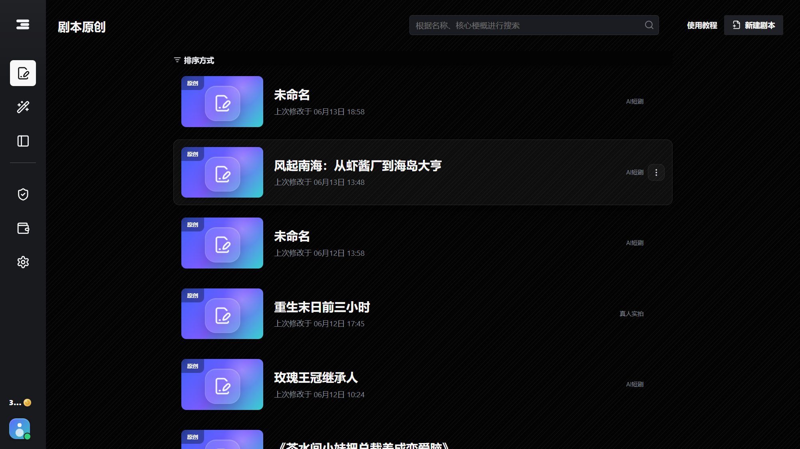

## 一、从零创建一个原创剧本

### 1. 点击「新建剧本」

在「剧本原创」页面，点右上角的 **新建剧本**。


这里有两个选择：

- **AI短剧**：适合做短视频、AI 视频、短剧账号内容。大部分创作从这里开始。
- **真人实拍**：适合后面要给拍摄团队看的剧本，更偏实际拍摄落地。

如果你只是想先把故事做出来，直接选 **AI短剧**。

### 2. 先看「故事设定」页面

进入后，默认会来到「故事梗概」里的故事设定页面。

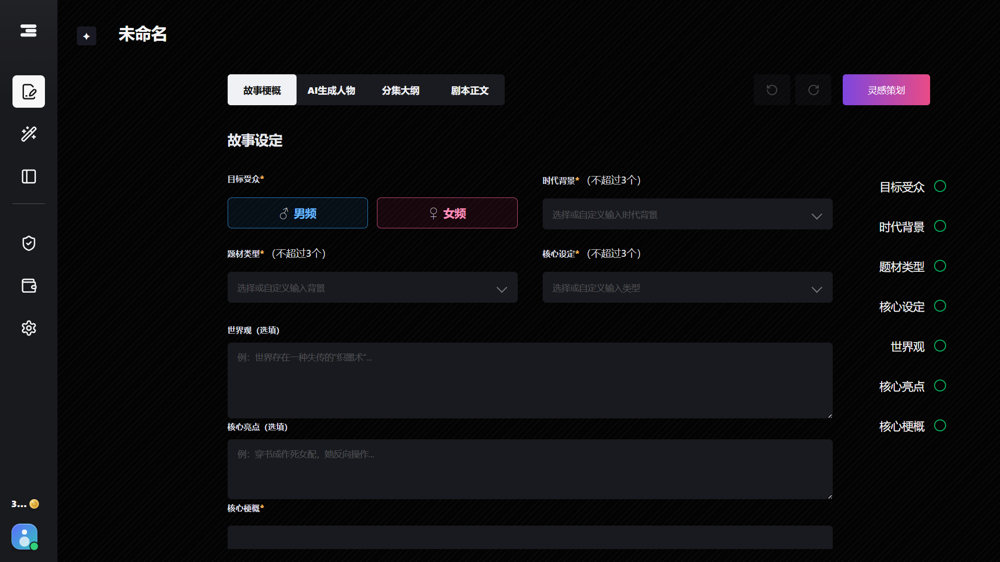

这里要填的是这部剧的底子：

- **目标受众**：男频还是女频。
- **时代背景**：现代都市、古装架空、校园青春等。
- **题材类型**：逆袭爽剧、悬疑反转、豪门甜宠等。
- **核心设定**：隐藏身份、真假继承人、马甲流等。
- **世界观**：故事发生在什么环境里。
- **核心亮点**：一句话说清楚这部剧最爽、最抓人的点。
- **核心梗概**：完整讲清楚主角是谁、遇到什么事、怎么反击、最后钩子是什么。

如果你已经想好了，可以直接填。

如果你只有一个模糊想法，不用卡在这里，直接点右上角 **灵感策划**。

## 二、用「灵感策划」先把故事方向定出来

### 1. 打开灵感策划

点右上角 **灵感策划** 后，右侧会打开一个策划面板。

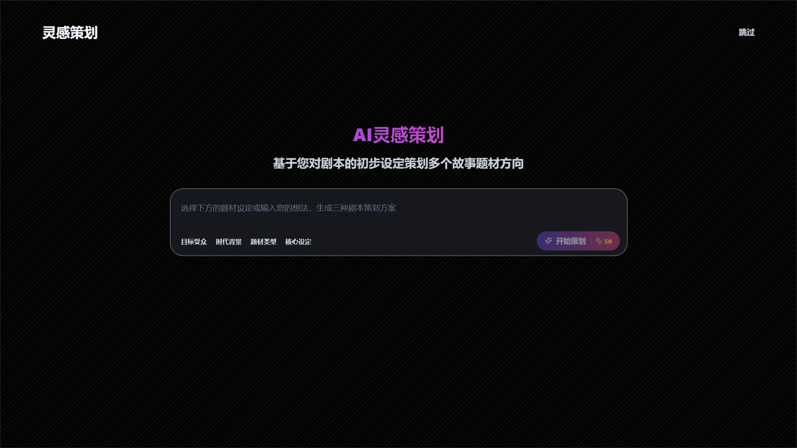

中间的大输入框里，写你想做的故事。不用写得很正式，像跟编剧交代需求一样就行。

比如：

```text
我想做一个女频短剧：女主被未婚夫和闺蜜联手背叛，意外拿到家族老宅的秘密账本，从一个被看不起的小透明，反击成掌控全局的继承人。希望剧情爽一点，反转多，适合一集一钩子。
```

### 2. 选择标签，让 AI 别跑偏

下面有几个按钮：

- **目标受众**
- **时代背景**
- **题材类型**
- **核心设定**

点开后选择合适的标签。比如我这里选了：

- 时代背景：现代都市
- 题材类型：悬疑反转、逆袭爽剧
- 核心设定：隐藏身份、真假继承人

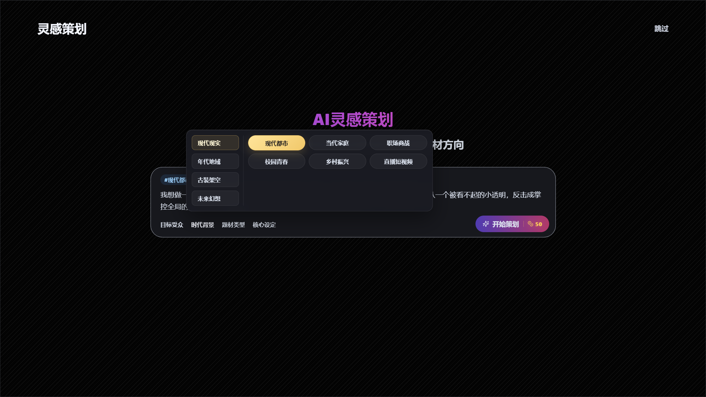

选完后，标签会同步出现在右侧面板，也会同步写到左边的故事设定里。

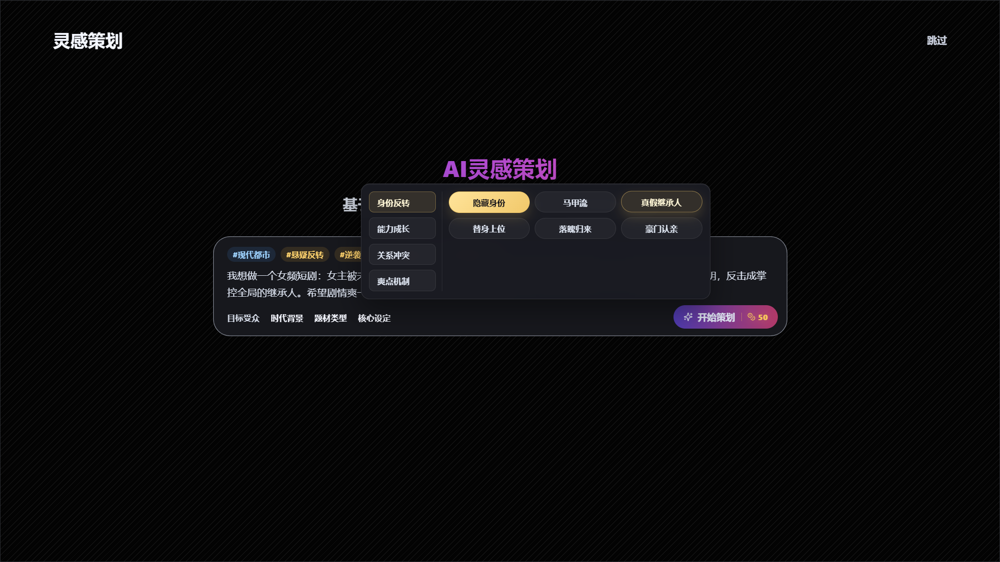

标签会直接影响 AI 给你的故事方向。

想要爽剧，就选「逆袭爽剧」「身份反转」这一类。  
想要感情线，就选「豪门甜宠」「先婚后爱」这一类。  
想要强钩子，就选「悬疑反转」「真假继承人」这一类。

### 3. 点击「开始策划」

确认输入和标签没问题后，点 **开始策划**。

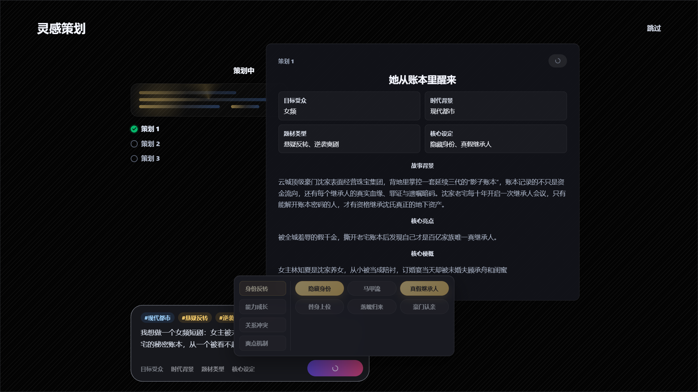

生成时页面会暂时锁住，等它跑完再操作。

### 4. 从生成的方案里选一个

生成完成后，会出现几个策划方案。

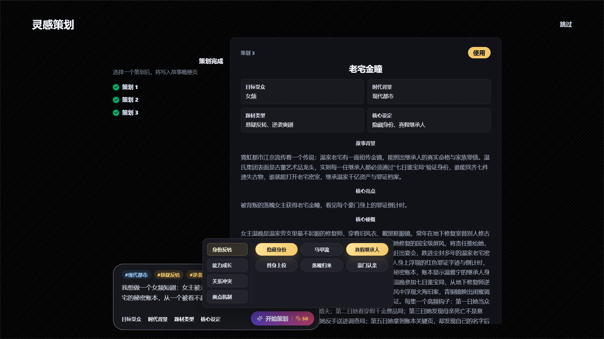

每个方案通常会包含：

- 剧名
- 目标受众
- 时代背景
- 题材类型
- 核心设定
- 故事背景
- 核心亮点
- 核心梗概

你不用手动复制内容。看哪个方案最接近你想要的故事，就点那个方案旁边的 **使用**。

点完后，平台会自动把方案写回故事设定页面：

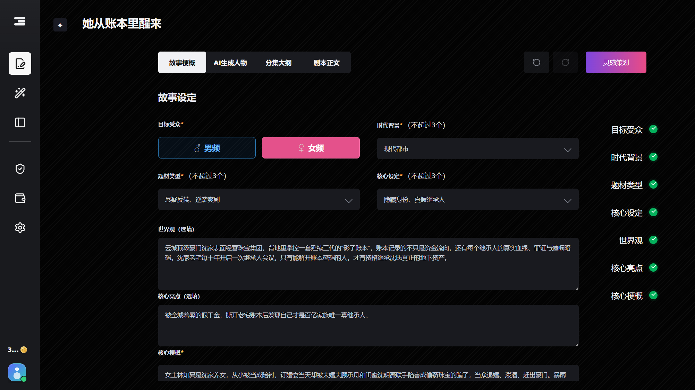

这一步很关键。它会自动填好：

- 剧本名称
- 世界观
- 核心亮点
- 核心梗概

你可以直接用，也可以在文本框里改。AI 只是帮你起草，最后以你确认后的内容为准。

## 三、生成角色小传

故事梗概确定后，点顶部的 **AI生成人物**。

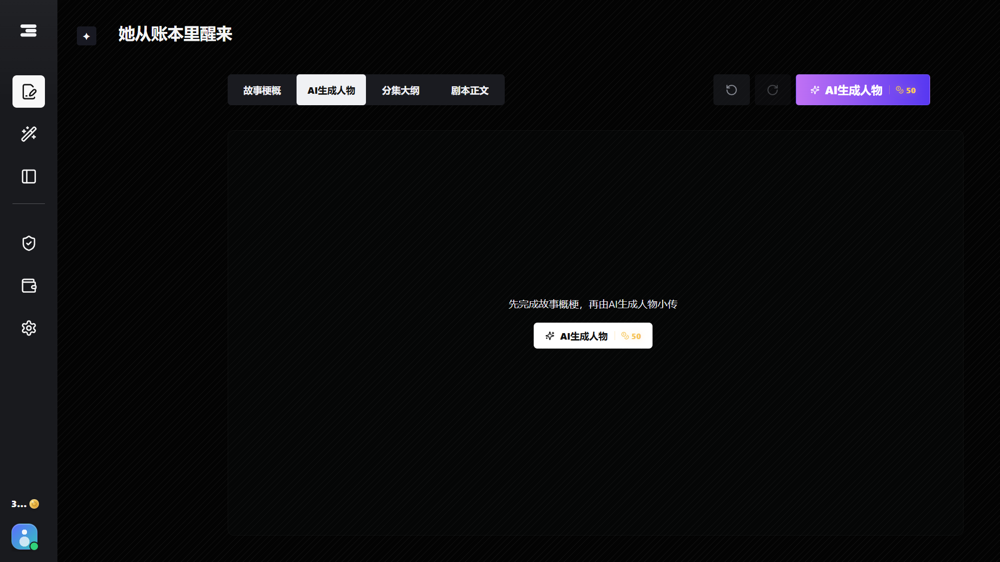

这里会提示你先完成故事梗概。前面用过灵感策划后，这一步就可以直接点 **AI生成人物**。

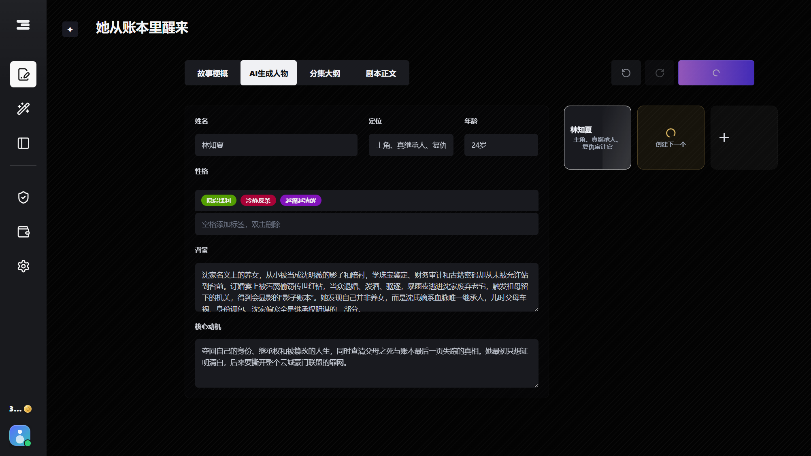

生成时会先出现角色表单，输入框会暂时锁住。等生成完，角色内容会自动填进去。

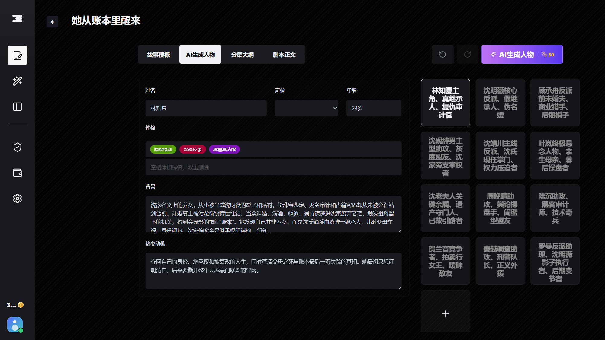

生成后重点检查这几块：

- **姓名**：角色名不顺口就直接改。
- **定位**：女主、男主、反派、助攻等。
- **年龄**：不合适就改。
- **性格**：这些是标签，可以用来稳定角色风格。
- **背景**：角色过去经历。
- **核心动机**：角色为什么要这么做。

下面一排角色按钮可以切换人物。比如点「沈明薇」就是看反派，点「顾承舟」就是看前未婚夫。

如果你觉得少了角色，点 **新增角色** 自己补。

## 四、生成分集大纲

人物确认后，点顶部 **分集大纲**。

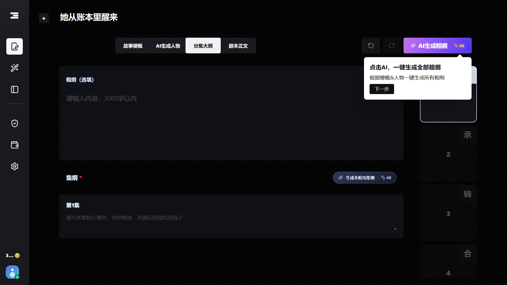

这里分两步：

1. 先生成粗纲。
2. 再生成每个阶段的集纲。

### 1. 先点「AI生成粗纲」

点 **AI生成粗纲** 后，会弹出总集数。

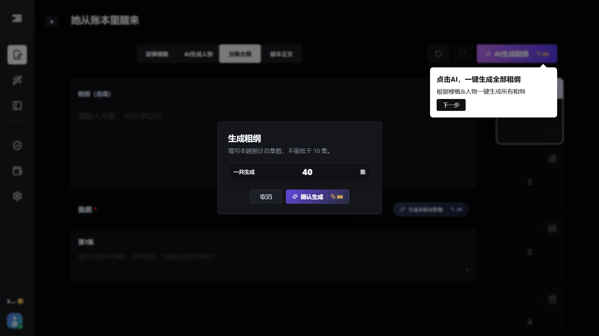

默认可能是 40 集。你可以按实际项目改。

如果只是先试效果，可以填少一点。  
如果是常规短剧，就按你实际要做的集数填。  
如果要做长篇，就按你的规划填。

注意：数字框里如果已有数字，先删掉旧数字，再输入新数字。

确认后点 **确认生成**。

### 2. 等粗纲生成完成

生成完成后，粗纲会写进上面的文本框。

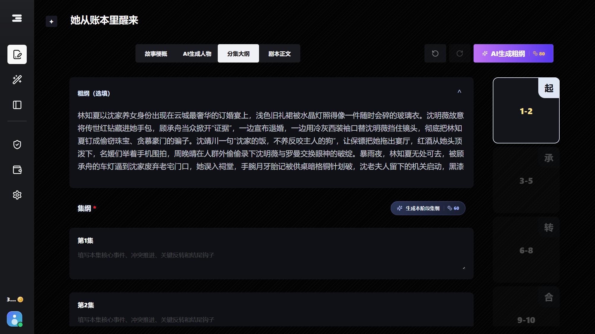

下面会出现阶段按钮，比如：

- 起 1-2
- 承 3-5
- 转 6-8
- 合 9-10

这些是剧情阶段。你当前在哪个阶段，就生成哪个阶段的集纲。

### 3. 生成当前阶段集纲

确认在「起 1-2」阶段后，点 **生成本阶段集纲**。

生成完成后，第 1 集、第 2 集会自动写好。

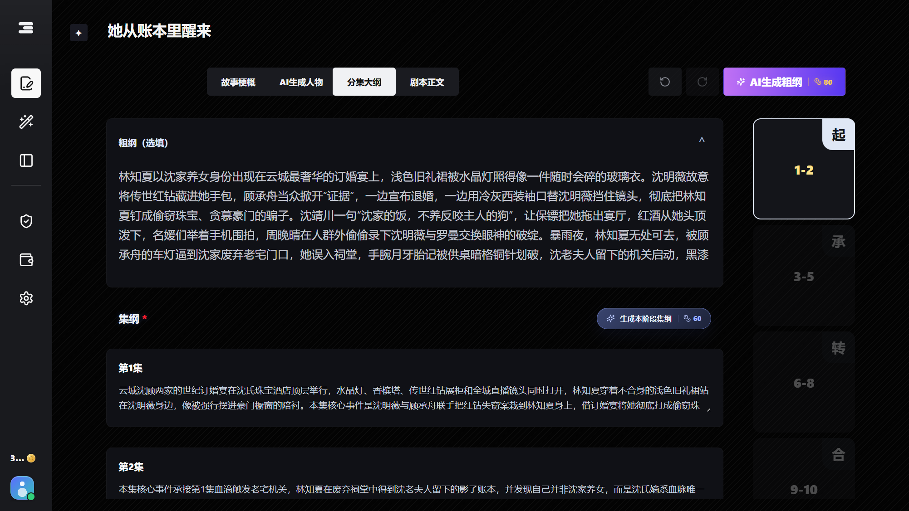

集纲里会写清楚：

- 本集发生什么事
- 主角目标是什么
- 冲突怎么推进
- 爽点或反转在哪里
- 结尾钩子是什么

这一步一定要看一遍。集纲越清楚，后面正文越稳。

如果某一集不满意，直接在文本框里改。比如把结尾钩子改强一点，或者把反派出场提前。

## 五、生成剧本正文

集纲有了以后，点顶部 **剧本正文**。

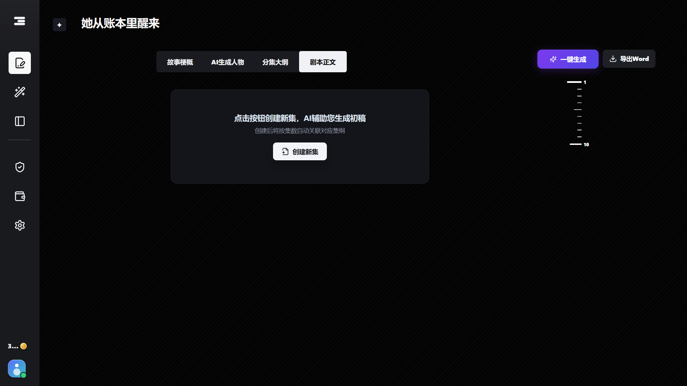

第一次进来，如果还没有正文，会看到 **创建新集**。

### 1. 点击「创建新集」

点 **创建新集** 后，会出现第 1 集正文编辑框。

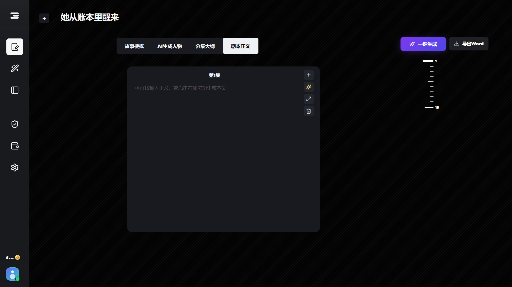

右侧几个按钮的意思：

- **新增下一集**：继续添加第 2 集、第 3 集。
- **生成本集**：根据这一集的集纲生成正文。
- **展开**：把编辑区放大，方便长文本修改。
- **删除**：删除当前集正文。

### 2. 点击「生成本集」

点 **生成本集** 后，正文会开始生成。

等生成完成后，按钮会变成 **重新生成本集**。

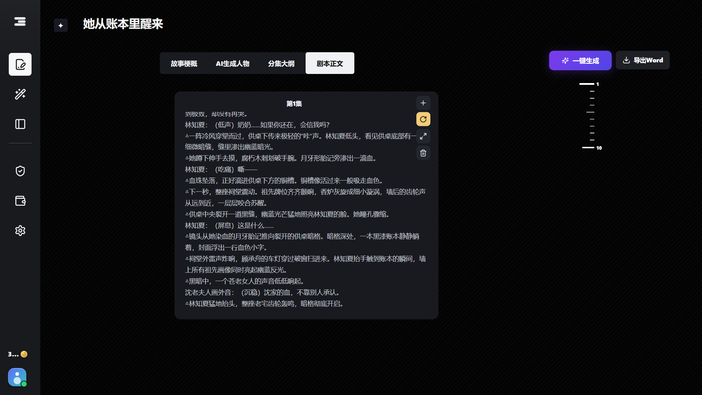

正文会按剧本格式写出来，比如：

- 场次
- 时间
- 内景/外景
- 人物
- 动作描写
- 对白

你可以直接在文本框里改。比如觉得台词太长，就删短；觉得场景不够清楚，就补一两句动作。

如果整集方向错了，先回到「分集大纲」改这一集集纲，再回来点 **重新生成本集**。

### 3. 继续生成后面的集数

第 1 集满意后，点 **新增下一集**，再点 **生成本集**。

建议按这个顺序做：

1. 先把当前阶段的集纲都生成好。
2. 再一集一集生成正文。
3. 每生成一集就检查一次，不要等全部生成完才看。

这样更省时间。前面集数如果方向错了，后面正文很容易一起跑偏。

### 4. 导出 Word

正文页面右上角有 **导出Word**。

当你生成并整理好正文后，点它就可以导出文档。

导出前建议先检查：

- 剧名有没有改好。
- 每一集是不是都有正文。
- 人名有没有前后不一致。
- 第 1 集开头够不够抓人。
- 每集结尾有没有钩子。

## 六、剧本改写怎么用

如果你手上已经有一个剧本，不想从零写，可以用 **剧本改写**。

点左侧 **剧本改写**。

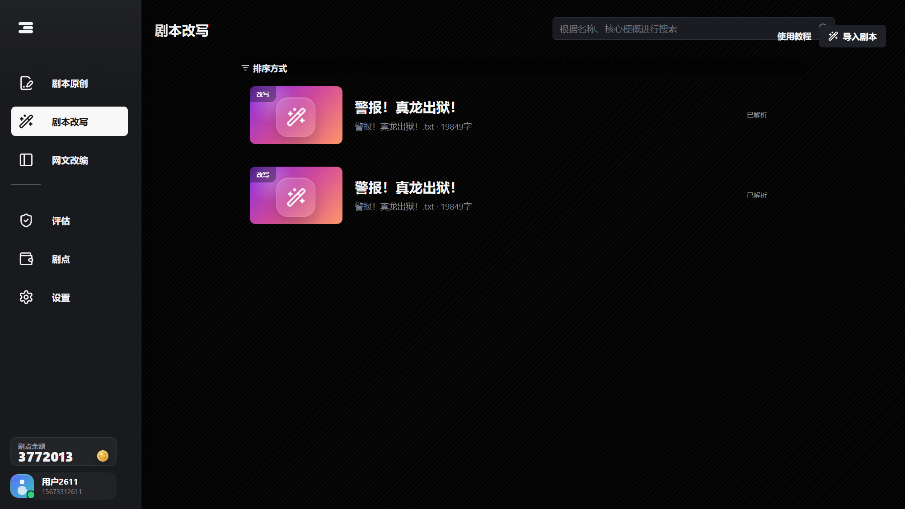

这里的核心操作是 **导入剧本**。

操作方式：

1. 点右上角或页面里的 **导入剧本**。
2. 选择你的剧本文档。
3. 等平台解析。
4. 解析完成后，列表里会出现项目，并显示 **已解析**。
5. 点项目进入编辑器。

进入后会看到「信息流」页面。

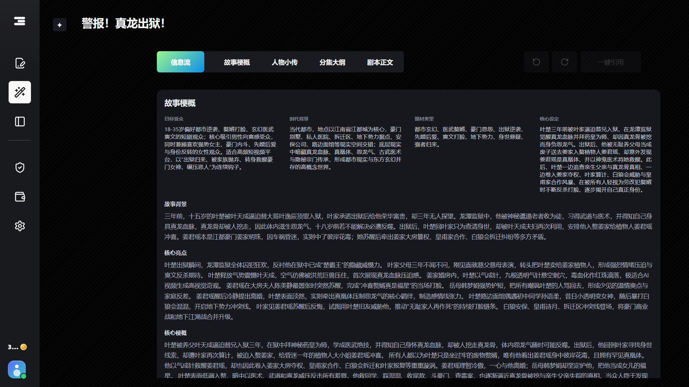

信息流会集中展示平台从原剧本里解析出来的内容：

- 故事梗概
- 人物设定
- 粗纲
- 集纲

后面怎么做，和原创剧本差不多：

1. 先看「故事梗概」，确认改写方向。
2. 再看「人物小传」，改掉不合适的人物。
3. 进入「分集大纲」，调整每集结构。
4. 最后进「剧本正文」，生成或修改正文。

改写时最重要的是先检查解析结果。原剧本如果解析错了，后面的梗概、大纲和正文都会跟着偏。

## 七、网文改编怎么用

如果你手上是小说，不是剧本，就用 **网文改编**。

点左侧 **网文改编**。

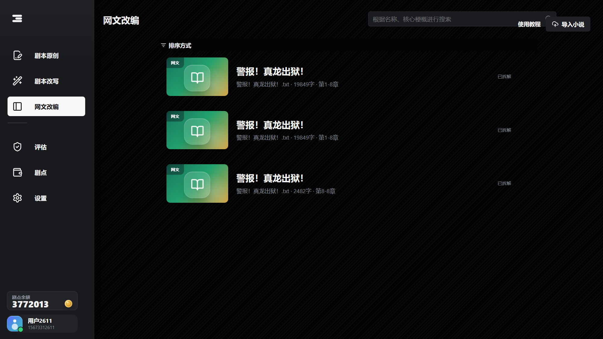

这里的核心操作是 **导入小说**。

操作方式：

1. 点 **导入小说**。
2. 选择小说文件。
3. 选择要改编的章节范围。
4. 等平台拆解章节。
5. 拆解完成后，列表会显示章节范围和 **已拆解**。
6. 点项目进入编辑器。

进入后，第一屏是 **小说章纲**。

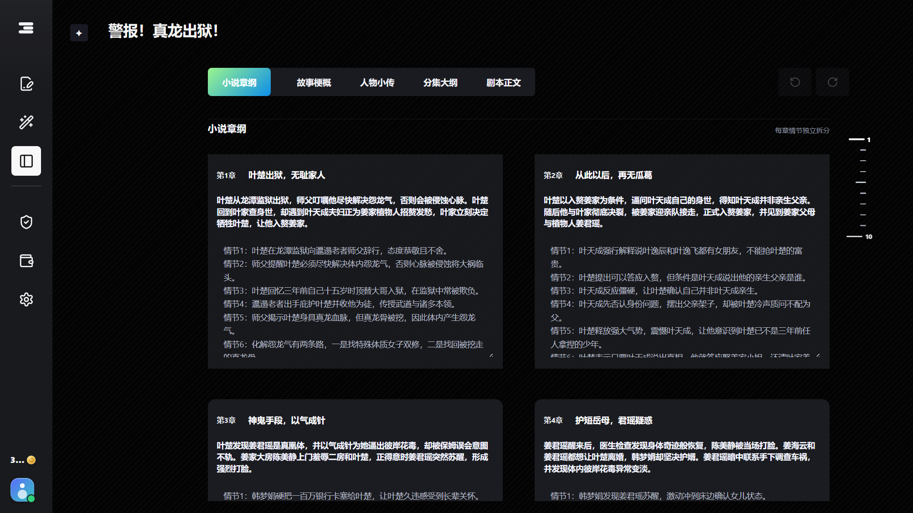

这里会把小说按章节拆开，每章一般包括：

- 章节标题
- 章节概要
- 情节 1、情节 2、情节 3……

你要先检查这一步：

- 章节有没有识别错。
- 内容有没有漏。
- 情节顺序对不对。
- 有没有把两章合成一章。

小说章纲没问题后，再继续点上方：

1. **故事梗概**
2. **人物小传**
3. **分集大纲**
4. **剧本正文**

后面的生成方式和原创剧本一样。

简单说，网文改编就是先把小说拆成章纲，再把章纲改成短剧结构，最后生成剧本正文。

## 八、实操时最容易踩的坑

### 1. 不要一上来就生成正文

正文前面至少要有：

- 故事梗概
- 人物小传
- 分集大纲

没有这些，正文容易空、散、没钩子。

### 2. 灵感策划不要只写一句太空的话

不要只写：

```text
写一个女频爽剧。
```

更好的是：

```text
写一个女频都市爽剧。女主被未婚夫和闺蜜背叛，意外发现自己才是真继承人，用账本揭穿豪门黑幕，每集都要有打脸和反转。
```

你给的信息越具体，生成结果越接近你想要的。

### 3. 标签最多选重点，不要乱堆

时代背景、题材类型、核心设定都不要乱选一堆，选最关键的几个就行。

比如你想要都市复仇，就围绕：

- 现代都市
- 悬疑反转
- 逆袭爽剧
- 隐藏身份
- 真假继承人

这样生成会更稳定。

### 4. 大纲不满意，先改大纲再生成正文

如果第 1 集集纲写得不够狠，别急着生成正文。

先把集纲改好，比如补上：

- 开头冲突
- 反派羞辱
- 主角反击
- 结尾悬念

然后再生成正文。

### 5. 生成后一定要人工检查

AI 能帮你快速出初稿，但最后一定要看：

- 人物名字有没有乱。
- 关系有没有前后矛盾。
- 台词有没有太长。
- 每集结尾有没有让人想看下一集。
- 爽点是不是够直接。

## 九、最快生成一部短剧的顺序

如果你想最快跑通一遍，就按这个顺序来：

1. 进入 **剧本原创**。
2. 点 **新建剧本**。
3. 选择 **AI短剧**。
4. 点 **灵感策划**。
5. 输入你的故事想法。
6. 选择标签。
7. 点 **开始策划**。
8. 从生成的方案里点 **使用**。
9. 点 **AI生成人物**。
10. 点 **分集大纲**。
11. 点 **AI生成粗纲**。
12. 设置总集数。
13. 点 **生成本阶段集纲**。
14. 点 **剧本正文**。
15. 点 **创建新集**。
16. 点 **生成本集**。
17. 检查正文。
18. 继续生成下一集。
19. 全部整理完后点 **导出Word**。

照这个流程走，就能从一个想法生成到可编辑的剧本正文。
